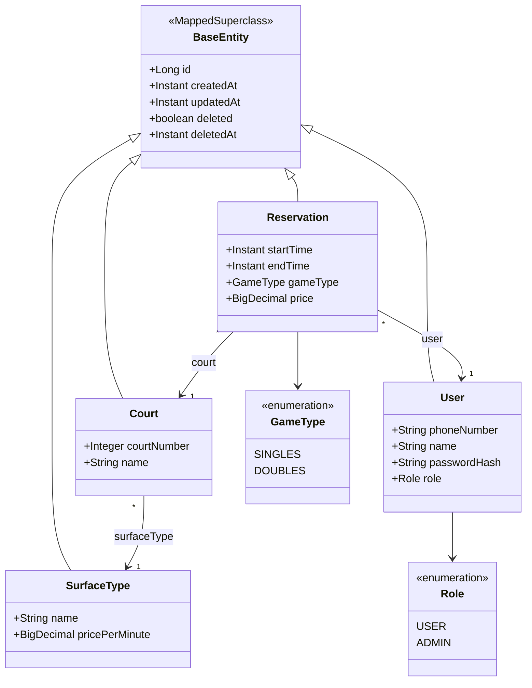

# Architektúra – Rezervačný systém tenisového klubu

Návrh riešenia zadania v `docs/zadanie.md` (originál `docs/zadanie.docx`), vrátane všetkých bonusov.
Dokument je návrh na diskusiu, kód sa zatiaľ nepíše. Sekcia [Otvorené otázky](#9-otvorené-otázky) obsahuje
všetko, čo zadanie nešpecifikuje, s mojím odporúčaním.

Fixné požiadavky (nie sú predmetom diskusie):

| # | Požiadavka |
|---|------------|
| 1 | DAO vrstva výhradne cez `EntityManager` + JPQL, generický `AbstractDao`. Spring Data JPA zakázané, vynútené ArchUnit testom. |
| 2 | Vrstvy controller → service → dao. DTO na hraniciach, entita nikdy v response. |
| 3 | Soft delete cez `BaseEntity` + explicitné filtrovanie v DAO. |
| 4 | Java 21, Spring Boot 3, H2, Maven, JaCoCo s limitom 90 % vo fáze `verify`. |
| 5 | Unit testy súčasťou každého kroku, nie na konci. |

---

## 1. Technologický stack

| Oblasť | Voľba | Poznámka |
|--------|-------|----------|
| Jazyk / build | Java 21, Maven | Maven wrapper (`mvnw`) v repozitári |
| Framework | Spring Boot 3.5.x | posledná 3.x línia |
| Web | `spring-boot-starter-web`, `spring-boot-starter-validation` | REST + Bean Validation |
| ORM | Hibernate 6 cez `spring-boot-starter-jdbc` + `hibernate-core` + `spring-orm` | **nie** `spring-boot-starter-data-jpa` (ťahá Spring Data). Auto-konfigurácia `HibernateJpaAutoConfiguration` funguje aj bez Spring Data. |
| DB | H2 in-memory | `jdbc:h2:mem:tennis` |
| Migrácie | Liquibase (bonus) | `ddl-auto=validate`, schéma výhradne z changelogu |
| Boilerplate | Lombok (bonus) | `lombok.config` s `lombok.addLombokGeneratedAnnotation=true` (JaCoCo ignoruje generovaný kód) |
| Security | Spring Security 6 + `spring-boot-starter-oauth2-resource-server` (Nimbus JWT, HS256) | bez tretej JWT knižnice, viď otázka O-11 |
| API dokumentácia | springdoc-openapi | Swagger UI, viď otázka O-19 |
| Testy | JUnit 5, Mockito, AssertJ, Spring Boot Test, ArchUnit | |
| Coverage | JaCoCo, `check` viazaný na `verify`, minimum 90 % | |
| Enforcement | maven-enforcer-plugin `bannedDependencies` na `org.springframework.data:*` | druhá poistka popri ArchUnit |

---

## 2. Dátový model

### 2.1 Prehľad



### 2.2 Entity

**`BaseEntity`** (`@MappedSuperclass`)

| Atribút | Typ | Poznámka |
|---------|-----|----------|
| `id` | `Long`, `@GeneratedValue(IDENTITY)` | |
| `createdAt` | `Instant` | nastaví `@PrePersist` (nie Spring Data auditing) |
| `updatedAt` | `Instant` | nastaví `@PreUpdate` |
| `deleted` | `boolean`, default `false` | soft delete flag |
| `deletedAt` | `Instant`, nullable | čas zmazania |

Metóda `markDeleted()` nastaví `deleted=true` a `deletedAt=now`. `equals/hashCode` podľa `id` (bez Lombok `@Data`; entity budú mať iba `@Getter/@Setter/@NoArgsConstructor`).

**`SurfaceType`** – číselník povrchov, spravovateľný cez API

| Atribút | Typ | Obmedzenie |
|---------|-----|------------|
| `name` | `String` | povinné, unikátne medzi nezmazanými |
| `pricePerMinute` | `BigDecimal(10,2)` | povinné, `>= 0` |

**`Court`**

| Atribút | Typ | Obmedzenie |
|---------|-----|------------|
| `courtNumber` | `Integer` | povinné, unikátne medzi nezmazanými, biznisový identifikátor z API ("unikátne číslo kurtu") |
| `name` | `String` | nepovinné (napr. „Centre court“) |
| `surfaceType` | `@ManyToOne(LAZY)` | povinné, iba nezmazaný povrch |

**`User`** – zákazník aj systémový účet v jednom (viď O-1)

| Atribút | Typ | Obmedzenie |
|---------|-----|------------|
| `phoneNumber` | `String` | povinné, unikátne medzi nezmazanými, login identifikátor |
| `name` | `String` | povinné |
| `passwordHash` | `String`, nullable | BCrypt; `null` = účet nemôže sa prihlásiť (zákazník vytvorený rezerváciou) |
| `role` | `enum Role {USER, ADMIN}` | default `USER` |

**`Reservation`**

| Atribút | Typ | Obmedzenie |
|---------|-----|------------|
| `court` | `@ManyToOne(LAZY)` | povinné |
| `user` | `@ManyToOne(LAZY)` | povinné (zákazník) |
| `startTime`, `endTime` | `Instant` | `start < end`, polootvorený interval `[start, end)` |
| `gameType` | `enum GameType {SINGLES, DOUBLES}` | povinné |
| `price` | `BigDecimal(10,2)` | snapshot vypočítanej ceny v čase vzniku/úpravy (viď O-6) |

Zoradenie „podľa dátumu vytvorenia“ používa `createdAt` z `BaseEntity`.

### 2.3 Biznisové pravidlá

- **Cena** = `minúty × pricePerMinute × (1.5 ak DOUBLES)`, zaokrúhlené `HALF_UP` na 2 desatinné miesta. Minúty = `Duration.between(start, end).toMinutes()`.
- **Prekrývanie**: rezervácia `R` koliduje s `X` na tom istom kurte, ak `R.start < X.end AND R.end > X.start` (pri nezmazaných `X`). Dotyk intervalov (`R.end == X.start`) nie je kolízia. Pri update sa vylučuje vlastné `id`.
- **Zákazník**: pri vzniku rezervácie sa hľadá nezmazaný `User` podľa telefónu; ak neexistuje, vytvorí sa s `role=USER`, `passwordHash=null`.
- **Soft delete**: nikdy `em.remove()`. DAO dotazy majú vždy podmienku `e.deleted = false`; `findById` vracia `Optional.empty()` pre zmazané.

### 2.4 Liquibase

`db/changelog/db.changelog-master.yaml` → `001-initial-schema.yaml` (tabuľky `surface_type`, `court`, `app_user`, `reservation`, FK, indexy na `reservation(court_id, start_time, end_time)`, `app_user(phone_number)`, `court(court_number)`). Bez unikátnych constraintov na biznisové kľúče v DB (dôvod: soft delete, viď O-8); unikátnosť rieši service vrstva.

---

## 3. Vrstvy

```
HTTP ──► controller ──► service ──► dao ──► EntityManager / H2
            │              │          │
          DTO            entity     entity
          mapper
```

| Vrstva | Zodpovednosť | Pravidlá |
|--------|--------------|----------|
| **controller** | HTTP mapovanie, validácia DTO (`@Valid`), status kódy | vidí iba `service` a `dto`. Žiadna entita v parametri ani návratovom type. Bez `@Transactional`. |
| **mapper** | entita ↔ DTO | ručné mapovanie (viď O-16), bez logiky |
| **service** | biznis logika, transakcie, výpočet ceny, validácia prekrývania, soft delete | jediné miesto s `@Transactional`. Vstup aj výstup entity alebo DTO podľa potreby, controller dostáva len DTO. |
| **dao** | perzistencia cez `EntityManager` + JPQL | `AbstractDao<T extends BaseEntity>` + interface per entita + impl. Každý dotaz explicitne filtruje `deleted = false`. Žiadna biznis logika. |
| **entity** | JPA model | nikdy neopustí service vrstvu smerom ku controlleru |
| **security** | JWT, filter, `UserDetailsService`, entry pointy 401/403 | používa `UserService` |
| **config** | properties, security config, inicializácia dát | |

### 3.1 DAO vrstva

```java
public interface GenericDao<T extends BaseEntity> {
    Optional<T> findById(Long id);      // iba nezmazané
    List<T> findAll();                  // iba nezmazané
    T save(T entity);                   // persist (id == null) / merge
    void softDelete(T entity);          // markDeleted() + merge
    boolean existsById(Long id);
}

public abstract class AbstractDao<T extends BaseEntity> implements GenericDao<T> {
    @PersistenceContext protected EntityManager em;
    private final Class<T> entityClass;
    // implementácia cez em.createQuery("SELECT e FROM " + entityName + " e WHERE e.deleted = false ...")
}
```

Konkrétne DAO (`CourtDao`, `SurfaceTypeDao`, `UserDao`, `ReservationDao`) rozširujú interface aj impl a pridávajú špecifické JPQL dotazy:

| DAO | Špecifické metódy |
|-----|-------------------|
| `SurfaceTypeDao` | `findByName`, `countCourtsUsing(surfaceTypeId)` |
| `CourtDao` | `findByCourtNumber`, `existsByCourtNumber` |
| `UserDao` | `findByPhoneNumber` |
| `ReservationDao` | `findByCourtNumberOrderByCreatedAt`, `findByPhoneNumber(phone, futureOnly)`, `existsOverlapping(courtId, start, end, excludeId)`, `existsFutureByCourt`, `existsFutureByUser` |

Súbežnosť pri vzniku rezervácie: service pred kontrolou prekrývania zamkne riadok kurtu (`em.lock(court, PESSIMISTIC_WRITE)`), takže dve súbežné rezervácie na ten istý kurt sa serializujú (viď O-7).

### 3.2 Spracovanie chýb

`@RestControllerAdvice` vracia RFC 7807 `ProblemDetail` (vstavané v Spring 6):

| Situácia | Status | Výnimka |
|----------|--------|---------|
| Bean Validation, nečitateľný JSON, zlý typ parametra | 400 | `MethodArgumentNotValidException`, … |
| Biznisová validácia (interval, prekrývanie, zmazaný povrch, …) | 400 | `ValidationException` (vlastná) |
| Entita neexistuje / je zmazaná | 404 | `NotFoundException` |
| Konflikt stavu (mazanie povrchu s kurtami, kurtu s budúcimi rezerváciami, duplicitné číslo kurtu) | 409 | `ConflictException` |
| Chýbajúci / neplatný / expirovaný token | 401 | `AuthenticationEntryPoint` |
| Nedostatočná rola | 403 | `AccessDeniedHandler` |

Prekrývanie rezervácie → **400** (zadanie explicitne uvádza „nevalidná rezervácia → 400“), viď O-10.

---

## 4. Štruktúra balíkov

Rozdelenie podľa vrstiev (jednoduché vynútenie ArchUnitom):

```
sk.knizat.tennisclub                      (groupId viď O-20)
├── TennisClubApplication.java
├── config/
│   ├── AppProperties.java                @ConfigurationProperties("app") – dataInit, security.jwt, security.admin
│   ├── SecurityConfig.java
│   ├── JwtConfig.java                    NimbusJwtEncoder/Decoder z HS256 secretu
│   ├── OpenApiConfig.java
│   └── DataInitializer.java              ApplicationRunner, aktívny pri app.data-init.enabled=true
├── controller/
│   ├── AuthController.java               /api/auth/**
│   ├── SurfaceTypeController.java        /api/surface-types
│   ├── CourtController.java              /api/courts
│   ├── ReservationController.java        /api/reservations
│   ├── UserController.java               /api/users
│   └── GlobalExceptionHandler.java
├── dto/
│   ├── surfacetype/  SurfaceTypeRequest, SurfaceTypeResponse
│   ├── court/        CourtRequest, CourtResponse
│   ├── reservation/  CreateReservationRequest, UpdateReservationRequest, ReservationResponse
│   ├── user/         CreateUserRequest, UpdateUserRequest, UserResponse
│   └── auth/         LoginResponse, RefreshTokenRequest
├── mapper/
│   ├── SurfaceTypeMapper, CourtMapper, ReservationMapper, UserMapper
├── service/
│   ├── SurfaceTypeService, CourtService, ReservationService, UserService, AuthService  (interfaces)
│   ├── impl/         …ServiceImpl
│   └── PriceCalculator.java              čistá funkcia, ľahko testovateľná
├── dao/
│   ├── GenericDao, AbstractDao
│   ├── SurfaceTypeDao, CourtDao, UserDao, ReservationDao      (interfaces)
│   └── impl/         …DaoImpl extends AbstractDao
├── entity/
│   ├── BaseEntity, SurfaceType, Court, User, Reservation, Role, GameType
├── exception/
│   ├── NotFoundException, ValidationException, ConflictException
└── security/
    ├── JwtTokenService.java              vydanie access/refresh tokenu, claims (sub=phone, role, typ)
    ├── JwtAuthenticationFilter.java      alebo BearerTokenAuthenticationFilter z resource-server
    ├── AppUserDetailsService.java
    └── RestAuthenticationEntryPoint / RestAccessDeniedHandler
```

Testy zrkadlia štruktúru v `src/test/java`, navyše `architecture/ArchitectureTest.java`.

DTO sú Java `record`y s Bean Validation anotáciami. Časy v API sú ISO-8601 s offsetom (`2026-09-03T10:00:00Z`), interne `Instant` (viď O-4).

---

## 5. Endpointy

Všetko pod `/api`. Rola: `USER` = čítanie + vznik rezervácie; `ADMIN` = všetko. `/api/auth/*` bez tokenu.

### 5.1 Auth (`/api/auth`, verejné)

| Metóda | Cesta | Vstup | Výstup | Poznámka |
|--------|-------|-------|--------|----------|
| POST | `/api/auth/login` | HTTP Basic (username = telefón, password) | 200, hlavička `Authorization: Bearer <access>`; body `{accessToken, refreshToken, accessExpiresAt, refreshExpiresAt}` | zlé údaje → 401 |
| POST | `/api/auth/refresh` | body `{refreshToken}` | 200, hlavička `Authorization: Bearer <access>` + rovnaké body | neplatný / expirovaný refresh → 401 |

### 5.2 Číselník povrchov (`/api/surface-types`)

| Metóda | Cesta | Rola | Status | Poznámka |
|--------|-------|------|--------|----------|
| GET | `/api/surface-types` | USER | 200 | zoznam nezmazaných |
| GET | `/api/surface-types/{id}` | USER | 200 / 404 | |
| POST | `/api/surface-types` | ADMIN | 201 + `Location` | 400 validácia, 409 duplicitný názov |
| PUT | `/api/surface-types/{id}` | ADMIN | 200 | zmena ceny neovplyvní existujúce rezervácie (snapshot) |
| DELETE | `/api/surface-types/{id}` | ADMIN | 204 | 409 ak ho používa nezmazaný kurt |

### 5.3 Kurty (`/api/courts`) – CRUD

| Metóda | Cesta | Rola | Status | Poznámka |
|--------|-------|------|--------|----------|
| GET | `/api/courts` | USER | 200 | |
| GET | `/api/courts/{id}` | USER | 200 / 404 | |
| POST | `/api/courts` | ADMIN | 201 + `Location` | body `{courtNumber, name?, surfaceTypeId}`; 409 duplicitné číslo |
| PUT | `/api/courts/{id}` | ADMIN | 200 | |
| DELETE | `/api/courts/{id}` | ADMIN | 204 | 409 ak má budúce nezmazané rezervácie (viď O-9) |

### 5.4 Rezervácie (`/api/reservations`) – RUD + vznik

| Metóda | Cesta | Rola | Status | Poznámka |
|--------|-------|------|--------|----------|
| POST | `/api/reservations` | USER | 201 + `Location` | body `{courtNumber, startTime, endTime, gameType, phoneNumber, customerName}`; response `ReservationResponse` vrátane `price`; 400 pri nevalidnom intervale alebo prekrývaní; 404 kurt |
| GET | `/api/reservations` | USER | 200 | filtre: `courtNumber` (zoradené podľa `createdAt` ASC), `phoneNumber` + `futureOnly=true|false` (zoradené podľa `startTime` ASC). Bez filtra vráti všetky (zoradené podľa `startTime`). Filtre sú kombinovateľné. |
| GET | `/api/reservations/{id}` | USER | 200 / 404 | |
| PUT | `/api/reservations/{id}` | ADMIN | 200 | body `{courtNumber, startTime, endTime, gameType}`; prepočíta cenu, re-validuje prekrývanie (bez seba); zákazník sa nemení (viď O-12) |
| DELETE | `/api/reservations/{id}` | ADMIN | 204 | |

`ReservationResponse`: `{id, courtNumber, courtName, startTime, endTime, gameType, price, customer: {phoneNumber, name}, createdAt}`.

### 5.5 Správa užívateľov (`/api/users`, bonus)

| Metóda | Cesta | Rola | Status | Poznámka |
|--------|-------|------|--------|----------|
| GET | `/api/users` | ADMIN | 200 | viď O-2 (USER môže vidieť len seba?) |
| GET | `/api/users/{id}` | ADMIN | 200 / 404 | |
| GET | `/api/users/me` | USER | 200 | prihlásený užívateľ |
| POST | `/api/users` | ADMIN | 201 | `{phoneNumber, name, password, role}`; 409 duplicitný telefón |
| PUT | `/api/users/{id}` | ADMIN | 200 | `{name, role, password?}` |
| DELETE | `/api/users/{id}` | ADMIN | 204 | 409 ak má budúce rezervácie; nemožno zmazať seba |

`UserResponse` nikdy neobsahuje `passwordHash`.

### 5.6 Security matrix (HTTP matcher v `SecurityConfig`)

```
permitAll:   /api/auth/**, /swagger-ui/**, /v3/api-docs/**, /h2-console/** (iba dev profil)
USER|ADMIN:  GET /api/**, POST /api/reservations, GET /api/users/me
ADMIN:       všetko ostatné pod /api/** (POST/PUT/DELETE, /api/users/**)
```

Stateless session, CSRF vypnuté, Basic auth povolená len na `/api/auth/login`, Bearer JWT všade inde.

---

## 6. Konfigurácia (`application.yml`)

```yaml
app:
  data-init:
    enabled: false                # zadanie: prepínač inicializácie 2 povrchov + 4 kurtov
  security:
    jwt:
      secret: ${APP_JWT_SECRET}   # min. 32 bajtov (HS256)
      access-token-validity: PT15M
      refresh-token-validity: P7D
    admin:                        # bootstrap ADMIN účtu (viď O-3)
      enabled: true
      phone-number: "+420000000000"
      name: Administrator
      password: ${APP_ADMIN_PASSWORD:admin}
```

Všetko prepísateľné env premennými (`APP_DATA_INIT_ENABLED=true`, …). Profily: `default` (dev, H2 konzola, data-init `true` v `application-dev.yml`), `test`.

Inicializácia dát (`DataInitializer`, `ApplicationRunner`): ak `app.data-init.enabled=true`, idempotentne vytvorí povrchy „Antuka“ (napr. 2,50/min) a „Umelá tráva“ (3,00/min) a kurty 1–4 (2× antuka, 2× tráva). Ak už existujú kurty, nič nerobí.

---

## 7. Stratégia testov

Cieľ: ≥ 90 % pokrytie (JaCoCo `INSTRUCTION` aj `LINE` na úrovni bundle), build padá vo `verify`. Vylúčené iba `TennisClubApplication` (main). Lombok-generovaný kód ignorovaný cez `@Generated`.

| Úroveň | Nástroj | Čo pokrýva |
|--------|---------|------------|
| **Unit – service** | JUnit 5 + Mockito | všetky `*ServiceImpl` s mockovanými DAO: cena, prekrývanie, vznik zákazníka, soft delete, konflikty, 404 |
| **Unit – čisté triedy** | JUnit 5 | `PriceCalculator`, mappery, `BaseEntity.markDeleted`, `JwtTokenService` (vydanie/parsovanie/expirácia), validátory |
| **DAO integračné** | `@SpringBootTest` + `@Transactional` na H2 (Liquibase schéma) | každý JPQL dotaz vrátane filtrovania soft-deleted záznamov a hraníc prekrývania (dotyk intervalov, exclude id). `@DataJpaTest` nepoužijeme, ak by vyžadoval Spring Data na classpath – overí sa v kroku 2. |
| **Web slice** | `@WebMvcTest` + `@MockBean` service + importovaná `SecurityConfig` | mapovanie DTO, validácia → 400, `ProblemDetail` formát, 401/403 per endpoint a rola |
| **End-to-end** | `@SpringBootTest(RANDOM_PORT)` + `MockMvc`/`TestRestTemplate` | scenáre: login → JWT → vznik rezervácie → cena; refresh; expirovaný token → 401; USER na DELETE → 403; data-init zapnutý/vypnutý |
| **Architektúra** | ArchUnit (`archunit-junit5`) | viď nižšie |

ArchUnit pravidlá (`ArchitectureTest`):

1. Žiadna trieda nezávisí od `org.springframework.data..` (aj `..data.jpa..`, `..data.domain..`).
2. `org.springframework.data.jpa.repository.JpaRepository` **nie je na classpath** (`Class.forName` → `ClassNotFoundException`).
3. Vrstvy: `controller` → `service` → `dao`; `dao` používa iba `service` (a `config` pre inicializáciu); `controller` nesiaha na `dao` ani `entity`.
4. Triedy v `controller` nemajú v signatúrach verejných metód typy z `entity`.
5. `@Transactional` iba v `service..`; `EntityManager` iba v `dao..`.
6. Všetky `*DaoImpl` rozširujú `AbstractDao`; všetky entity rozširujú `BaseEntity`.

Testy sú súčasťou každého implementačného kroku (požiadavka 5). Jediný `mvn verify` spúšťa všetko (bez failsafe separácie, viď O-18).

---

## 8. Plán implementácie (každý krok = kód + testy + zelený `mvn verify`)

| Krok | Obsah | Testy |
|------|-------|-------|
| 0 | Skeleton: `pom.xml` (bez Spring Data, enforcer, JaCoCo 90 %), `application.yml`, `lombok.config`, `.gitignore`, `README`, `CLAUDE.md` | ArchUnit test (zatiaľ na prázdnych balíkoch), context loads |
| 1 | `BaseEntity`, entity, enumy, Liquibase changelog | unit `BaseEntity`, context loads s `ddl-auto=validate` |
| 2 | `GenericDao`/`AbstractDao` + 4 DAO | DAO integračné testy na H2 |
| 3 | Číselník povrchov: service, mapper, DTO, controller, exception handler | unit service, WebMvc, e2e |
| 4 | Kurty CRUD | unit, WebMvc, e2e |
| 5 | Rezervácie: `PriceCalculator`, vznik (zákazník, prekrývanie, zámok), RUD, zoznamy s filtrami | unit (hrany intervalov, 1.5×, zaokrúhlenie), DAO, WebMvc, e2e |
| 6 | Data init prepínač | e2e s oboma hodnotami property |
| 7 | Security: `User` účty, BCrypt, login Basic → JWT v hlavičke, refresh, 401/403, role matrix, bootstrap admin | unit `JwtTokenService`, WebMvc security matrix, e2e login/refresh/expirácia |
| 8 | Správa užívateľov `/api/users` | unit, WebMvc, e2e |
| 9 | springdoc, README (spustenie, konfigurácia, príklady curl), UML: class diagram + sekvenčný diagram vzniku rezervácie + diagram balíkov (PlantUML zdroj + render), `docs/ai/` s históriou | finálny `mvn verify`, review pokrytia |

---

## 9. Otvorené otázky

Všetko, čo zadanie nešpecifikuje a nie je v tvojich požiadavkách. Pri každej je moje odporúčanie, ktoré použijem, ak nepovieš inak.

### A. Rozhodnutia s dopadom na model / API

**O-1 · Je zákazník rezervácie a systémový užívateľ (login, rola) tá istá entita?**
Zadanie hovorí o „užívateľovi“ v oboch významoch (vzniká pri rezervácii; má rolu a heslo).
*Odporúčanie:* jedna entita `User` s telefónom ako login identifikátorom. Zákazník vytvorený rezerváciou má `role=USER` a `passwordHash=null` (nemôže sa prihlásiť, kým mu ADMIN nenastaví heslo). Jednoduchšie, bez duplicity mena/telefónu. *Alternatíva:* oddelené `Customer` a `Account` (čistejšie domény, ale viac kódu a otázka prepojenia).

**O-2 · Môže USER vytvoriť rezerváciu na ľubovoľné telefónne číslo, alebo iba na svoje?**
Zadanie: USER má „založenie rezervácie“. Nehovorí pre koho.
*Odporúčanie:* USER vytvára rezervácie na ľubovoľné číslo (model recepčného; pri vzniku sa vytvára nový zákazník, čo pri „iba na seba“ nedáva zmysel, lebo účet už existuje). Zoznamy rezervácií podľa telefónu sú pre USER tiež bez obmedzenia (zadanie: USER má všetky READ operácie). `/api/users` list iba pre ADMIN, `/api/users/me` pre USER.

**O-3 · Ako vznikne prvý ADMIN, keď sú všetky endpointy za JWT a registrácia neexistuje?**
*Odporúčanie:* bootstrap z externej konfigurácie `app.security.admin.*` (samostatný prepínač, nezávislý od `app.data-init`, s defaultom `true`; heslo cez env, dev default `admin`). Vytvorí sa iba ak neexistuje nezmazaný užívateľ s daným telefónom. *Alternatíva:* verejný `POST /api/auth/register` (zadanie ho nespomína a `/api/auth/*` je verejné, takže by šlo, ale registrácia ADMINa verejne je nezmysel).

**O-4 · Formát času a časová zóna.**
*Odporúčanie:* API aj DB v `Instant` (ISO-8601 s offsetom, napr. `2026-09-03T10:00:00Z` alebo `+02:00`), DB stĺpce `TIMESTAMP WITH TIME ZONE`. „Budúcnosť“ = porovnanie s `Instant.now()` cez injektovaný `Clock` (testovateľné). *Alternatíva:* `LocalDateTime` v lokálnej zóne klubu (jednoduchšie pre klienta, horšie pri DST).

**O-5 · Čo je „zmysluplný časový interval“?**
*Odporúčanie:* `start < end`, `start >= now` (nie do minulosti), dĺžka **15 min až 4 h** (ako konfigurovateľné `app.reservation.min-duration` / `max-duration`), časy zaokrúhlené na celé minúty (sekundy = 0). Porušenie → 400. *Alternatíva:* iba `start < end` (minimalistické, ale umožní rezerváciu na 1 sekundu alebo do roku 1990).

**O-6 · Ukladať cenu do rezervácie, alebo ju počítať za behu?**
Cena povrchu sa môže meniť (číselník).
*Odporúčanie:* uložiť snapshot `price` pri vzniku/úprave. Rezervácia vytvorená za 2,50/min ostane za tú cenu aj po zmene číselníka. Prepočet iba pri `PUT /api/reservations/{id}`.

**O-7 · Súbežné vytváranie rezervácií na ten istý kurt.**
Dve paralelné požiadavky prejdú kontrolou prekrývania a obe sa uložia.
*Odporúčanie:* `PESSIMISTIC_WRITE` zámok na riadok kurtu v rámci transakcie vzniku/úpravy. Lacné, funguje na H2, dá sa otestovať. *Alternatíva:* ignorovať (single-user test app) alebo `SERIALIZABLE` izolácia.

**O-8 · Unikátnosť biznisových kľúčov (číslo kurtu, názov povrchu, telefón) vs. soft delete.**
DB `UNIQUE` constraint by bránil znovu vytvoriť kurt č. 3 po jeho soft delete.
*Odporúčanie:* unikátnosť iba medzi nezmazanými záznamami, kontrolovaná v service cez DAO (`existsByCourtNumber` a pod.) → 409. V DB len obyčajný index. Po soft delete zákazníka a novej rezervácii na rovnaký telefón vznikne nový `User` (starý ostáva zmazaný s históriou).

**O-9 · Kaskáda soft delete.**
Čo s rezerváciami pri zmazaní kurtu / užívateľa, s kurtami pri zmazaní povrchu?
*Odporúčanie:* žiadna kaskáda, ale ochrana: povrch s nezmazanými kurtami → 409; kurt alebo užívateľ s **budúcimi** nezmazanými rezerváciami → 409; minulé rezervácie ostávajú ako história a sú stále čitateľné (aj cez `courtNumber` zmazaného kurtu). *Alternatíva:* kaskádne soft-delete rezervácií (prídeme o históriu, viac kódu).

**O-10 · Status kód pri prekrývaní rezervácie: 400 alebo 409?**
Sémanticky je to konflikt (409), ale bonus explicitne hovorí „nevalidná rezervácia → 400“ a prekrývanie je jediná validácia, ktorú zadanie menuje.
*Odporúčanie:* **400** s `ProblemDetail.detail` = „interval sa prekrýva s rezerváciou #id“. 409 ponechať pre konflikty stavu pri mazaní/duplicitách (O-8, O-9).

**O-11 · JWT knižnica a refresh token.**
*Odporúčanie:* `spring-boot-starter-oauth2-resource-server` (Nimbus, HS256, secret z konfigurácie), bez `jjwt`. Refresh token = stateless JWT s claimom `type=refresh` a vlastnou platnosťou; `POST /api/auth/refresh` s tokenom v JSON body. Bez ukladania do DB (nedá sa revokovať, pre zadanie akceptovateľné). *Alternatíva:* refresh token v DB (revokácia, logout), viac kódu a entita navyše. Login odpoveď: token v hlavičke `Authorization` (podľa zadania) **a** v body (pohodlie pre klienta).

**O-12 · Čo je updatovateľné na rezervácii (U v RUD)?**
*Odporúčanie:* kurt, začiatok, koniec, typ hry; cena sa prepočíta, prekrývanie re-validuje. Zákazník sa nemení (zmena = zmazať + vytvoriť). Update iba ADMIN (zadanie: USER má okrem vzniku iba READ).

**O-13 · Rezervácia s existujúcim telefónom, ale iným menom.**
Zadanie: „k telefónu sa ukladá vždy rovnaké meno“.
*Odporúčanie:* meno v požiadavke sa použije **iba pri vytvorení** nového zákazníka; pri existujúcom sa ignoruje a v odpovedi je uložené meno. Zmenu mena rieši `PUT /api/users/{id}`. *Alternatíva:* pri nezhode 400 (prísnejšie, ale „Ján Novák“ vs „Jan Novak“ by padalo).

**O-14 · Formát telefónneho čísla.**
*Odporúčanie:* validácia regexom E.164 `^\+[1-9][0-9]{7,14}$`, pred uložením odstrániť medzery a pomlčky. Telefón je zároveň login (Basic username). *Alternatíva:* voľný string (jednoduchšie, ale „+420 123“ a „+420123“ budú dvaja zákazníci).

**O-15 · Zoradenie a rozsah zoznamov.**
Zadanie určuje iba „podľa dátumu vytvorenia“ pri filtrovaní podľa kurtu.
*Odporúčanie:* podľa kurtu `createdAt ASC`; podľa telefónu a bez filtra `startTime ASC`; `futureOnly` = `startTime > now` (prebiehajúca rezervácia nie je „v budúcnosti“). Bez stránkovania (malé dáta). Filtrovanie cez query parametre `GET /api/reservations?courtNumber=&phoneNumber=&futureOnly=` (telefón s `+` v path by bol nepekný). *Alternatíva:* sub-resource `GET /api/courts/{courtNumber}/reservations`.

### B. Technické voľby

**O-16 · Mapovanie entita ↔ DTO: ručne alebo MapStruct?**
*Odporúčanie:* ručné mappery (malé DTO, žiadny ďalší annotation processor vedľa Lomboku, plne testovateľné, čitateľné). MapStruct by tu ušetril možno 60 riadkov.

**O-17 · Inicializácia dát: `ApplicationRunner` alebo Liquibase context?**
*Odporúčanie:* `ApplicationRunner` podmienený `@ConditionalOnProperty` – ide cez service/DAO (soft delete, `createdAt`), idempotentný, unit-testovateľný. Liquibase changelog ostáva čisto schémový. *Alternatíva:* Liquibase `context: seed` zapnutý cez property (menej kódu, ale dáta mimo aplikačnej logiky a horšie testovateľné).

**O-18 · Ako splniť „unit testy pokryjú 90 %“, keď JaCoCo počíta aj integračné testy?**
*Odporúčanie:* všetky testy pod Surefire v jednom `mvn verify`, jeden JaCoCo report; väčšina pokrytia príde zo skutočných unit testov (service, kalkulátor, mappery, JWT), integračné doplnia DAO/security. Neoddeľovať Failsafe (zbytočná zložitosť). Merateľná hranica: 90 % `INSTRUCTION` aj `LINE`, bez vylúčení okrem `main`.

**O-19 · springdoc-openapi (Swagger UI)?**
Zadanie chce „dobrú dokumentáciu“.
*Odporúčanie:* áno, `/swagger-ui` a `/v3/api-docs` verejné (bez JWT), s definovanou `bearerAuth` schémou, aby sa dalo klikať v prehliadači. Malý náklad, veľký efekt pre hodnotiteľa.

**O-20 · groupId / koreňový balík, názov artefaktu, mena.**
*Odporúčanie:* `sk.knizat.tennisclub`, artefakt `tennis-club-reservations`. Cena bez meny (dokumentovať ako CZK v README), `BigDecimal(10,2)`.

**O-21 · UML diagramy: nástroj a formát.**
Zadanie vyžaduje „UML diagram a CLASS diagram“ v repozitári.
*Odporúčanie:* PlantUML zdroje v `docs/uml/` + vyrenderované SVG/PNG commitnuté (hodnotiteľ nemusí nič inštalovať). Diagramy: class diagram (entity + vrstvy), sekvenčný diagram vzniku rezervácie, diagram balíkov/komponentov. Render cez PlantUML jar v CI kroku alebo lokálne. *Alternatíva:* iba Mermaid v Markdown (GitHub ho renderuje, ale nie je to „súbor s diagramom“).

**O-22 · História AI komunikácie.**
Zadanie vyžaduje priloženie histórie chatov a súborov pre agenta.
*Odporúčanie:* `docs/ai/` s exportom každej session (Markdown), `CLAUDE.md` v koreni repozitára (odkazuje na tento dokument) a tento `ARCHITECTURE.md`. **Export session musíš spraviť ty** (ja k vlastnej histórii nemám prístup), ideálne po každom väčšom kroku.

**O-23 · CI (GitHub Actions) s `mvn verify`?**
Nie je v zadaní.
*Odporúčanie:* áno, jeden workflow (`.github/workflows/ci.yml`, JDK 21, `./mvnw verify`, upload JaCoCo reportu). Dokazuje hodnotiteľovi zelený build a 90 % limit bez lokálneho spúšťania.

**O-24 · Optimistic locking (`@Version`) v `BaseEntity`?**
*Odporúčanie:* nie. Konflikty rieši O-7 zámok; `@Version` by skomplikoval DTO (klient by musel posielať verziu) bez prínosu pre zadanie.

**O-25 · Konfigurovateľný násobok pre štvorhru (1.5)?**
*Odporúčanie:* konštanta v `PriceCalculator` (`DOUBLES_MULTIPLIER = 1.5`), nie property. Zadanie hovorí o pevnom násobku; property by bola over-engineering. Ak chceš, presuniem do `app.reservation.doubles-multiplier`.

### C. Zhrnutie – čo potrebujem od teba

Stačí prejsť zoznam a napísať čísla otázok, kde nesúhlasíš s odporúčaním. Kľúčové pre začiatok kódovania sú **O-1, O-2, O-3, O-4, O-5, O-10, O-11, O-20**; ostatné sa dajú zmeniť aj neskôr s malým dopadom.
