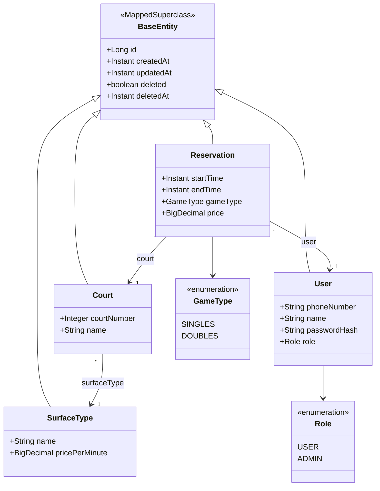

# 03. OK

Session `session-ece6cbbd.jsonl`, started 2026-09-03T16:45:49.958Z. 71 records, 2 sub-agent transcript(s) inlined.

Legend: 🧑 user · 🤖 assistant · 🔧 tool call · ↳ tool result · 🧵 sub-agent.

---

### 🧑 user — 16:45:49

OK

### 🤖 assistant — 16:45:55

Commitnem a pushnem krok 0, potom spustím implementačného agenta pre krok 1 (entity, enumy, Liquibase schéma).

**🔧 Bash** 16:45:59

_Commit and push step 0_

```bash
git add -A && git commit -q -m "Step 0: project skeleton

Maven build with Spring Boot 3.5.16, Hibernate without Spring Data (enforcer ban),
JaCoCo 90% check in verify, Maven wrapper, AppProperties, Clock bean, layered
package skeleton, profiles and ArchUnit rules with tests.

Co-Authored-By: Claude Fable 5.1 <noreply@anthropic.com>
Claude-Session: https://claude.ai/code/session_01HG4QMjJL1R2wpPsJzvgL65" && git push -q -u origin claude/java-project-architecture-docs-mbchc0 && git log --oneline | head -1
```

**↳ Bash** 16:46:03

<details><summary>tool result</summary>

```
7d1b35f Step 0: project skeleton
```

</details>

**🔧 Agent** 16:46:36

**Step 1: entities and Liquibase** {"subagent_type": "general-purpose", "run_in_background": false}

prompt:

```text
You are implementing **Step 1 (entities, enums, Liquibase schema)** of a Spring Boot 3.5 / Java 21 project in `/home/user/inqool_zadanie`. Step 0 (skeleton, pom, ArchUnit rules, profiles) is already done and `./mvnw verify` passes. Read `CLAUDE.md` first (hard rules, stack, conventions). Then read ONLY these parts of `docs/ARCHITECTURE.md`: §2 (Dátový model, all subsections incl. 2.4 Liquibase) and the Step 1 row of §8. Also look at the existing `src/test/java/sk/knizat/tennisclub/architecture/ArchitectureTest.java` so your code satisfies its rules (every `@Entity` must extend `BaseEntity` and live in `sk.knizat.tennisclub.entity`). Do not modify `docs/`, `pom.xml` or the ArchUnit test. Do not commit.

## Deliverables

1. `entity/BaseEntity.java` (`@MappedSuperclass`, Lombok `@Getter @Setter @NoArgsConstructor` only):
   - `id` Long `@Id @GeneratedValue(IDENTITY)`; `createdAt`, `updatedAt` (`Instant`, not null); `deleted` (boolean, not null, default false); `deletedAt` (`Instant`, nullable).
   - `@PrePersist` sets `createdAt` and `updatedAt`, `@PreUpdate` sets `updatedAt`. Inside the entity use `Instant.now()` is NOT allowed by CLAUDE.md ("never Instant.now() in business code") — but JPA callbacks cannot receive an injected `Clock`. Resolve this by: `markDeleted(Instant now)` takes the timestamp as a parameter (service passes `clock.instant()`), and for `createdAt/updatedAt` implement the callbacks in a small `entity/AuditingEntityListener` (`@EntityListeners`) that reads a static `Clock` holder? No — keep it simple and testable: `BaseEntity` has `@PrePersist onCreate()` / `@PreUpdate onUpdate()` that fill the timestamps only if they are `null` (persist) / always (update) using `Instant.now()`, and document in Javadoc that these are infrastructure timestamps, the single sanctioned use of `Instant.now()`. Additionally, expose `markDeleted(Instant now)` (sets `deleted=true`, `deletedAt=now`) and `boolean isDeleted()`.
   - `equals`/`hashCode` based on `id` only when non-null (`getClass()` comparison; unsaved entities are equal only to themselves). `toString` with class name and id.
2. Enums `entity/Role` (`USER`, `ADMIN`) and `entity/GameType` (`SINGLES`, `DOUBLES`). Put the doubles price multiplier constant later (Step 5), not now.
3. Entities per §2.2, all `@Entity` with explicit `@Table(name=...)` and `@Column(name=..., nullable=..., length=...)`, `@Enumerated(EnumType.STRING)` for enums, `@ManyToOne(fetch = LAZY, optional = false)` with `@JoinColumn`:
   - `SurfaceType` → table `surface_type` (`name` varchar 100 not null, `price_per_minute` decimal(10,2) not null).
   - `Court` → table `court` (`court_number` int not null, `name` varchar 100 nullable, `surface_type_id` FK not null).
   - `User` → table `app_user` (`phone_number` varchar 20 not null, `name` varchar 100 not null, `password_hash` varchar 100 nullable, `role` varchar 20 not null).
   - `Reservation` → table `reservation` (`court_id` FK, `user_id` FK, `start_time`/`end_time` timestamp with time zone not null, `game_type` varchar 20 not null, `price` decimal(10,2) not null).
   - Common columns from BaseEntity on every table: `id` bigint identity PK, `created_at`, `updated_at` timestamp with time zone not null, `deleted` boolean not null default false, `deleted_at` timestamp with time zone nullable.
   - No `@Where`, `@SQLDelete`, `@SoftDelete`, no unique constraints on business keys (soft delete, §2.4). Short Javadoc on each class.
4. Liquibase: `src/main/resources/db/changelog/db.changelog-master.yaml` including `db/changelog/changes/001-initial-schema.yaml` with changeSets (author `tennisclub`) creating the 4 tables, FKs, and indexes: `idx_reservation_court_time (court_id, start_time, end_time)`, `idx_app_user_phone (phone_number)`, `idx_court_number (court_number)`. Column types must match what Hibernate 6 expects so `spring.jpa.hibernate.ddl-auto=validate` passes on H2: use `bigint`, `varchar(n)`, `decimal(10,2)`, `boolean`, `timestamp with time zone` (Hibernate maps `Instant` to `TIMESTAMP_UTC` = `timestamp with time zone` on H2; if validation complains, adjust the Liquibase type and report what you had to use). `defaultValueBoolean: false` on `deleted`.
5. Tests (all must follow `should_<expected>_when_<condition>` naming):
   - Pure unit test `entity/BaseEntityTest` (no Spring): `markDeleted` sets flags, `onCreate`/`onUpdate` behaviour (call the callback methods directly), `equals/hashCode` contract (same id equal, different id not equal, null id only self-equal, different class not equal), `toString`.
   - Unit tests for the entities' trivial behaviour are unnecessary (Lombok getters/setters are excluded from JaCoCo via `@Generated`), but the callback and equals code must be covered.
   - Integration test `entity/SchemaValidationTest`: `@SpringBootTest` + `@ActiveProfiles("test")` that proves Liquibase created the schema and Hibernate validated it (context loads), and additionally, using the injected `EntityManagerFactory` or `JdbcTemplate`, asserts the 4 tables exist (e.g. query `INFORMATION_SCHEMA.TABLES`). Also persist one full object graph (surface type → court → user → reservation) inside a `TransactionTemplate` / `@Transactional` test and read it back with `em.find`, checking `createdAt`/`updatedAt` were filled by the callbacks. Use `EntityManager` only inside the test (tests are excluded from ArchUnit). You may obtain an `EntityManager` via `EntityManagerFactory#createEntityManager()` with a manual transaction, or `@PersistenceContext` + `@Transactional` on the test class (Spring's `PersistenceAnnotationBeanPostProcessor` supports that).

## Verification (mandatory)

Run `./mvnw -q verify`; it must pass: compilation, all tests, ArchUnit, JaCoCo ≥ 90 % (INSTRUCTION and LINE). If coverage drops below 90 % because of entity code, add real unit tests rather than exclusions. Do not change the threshold.

## Final report (under 40 lines)

Files created/changed, the `./mvnw verify` outcome with test count, the Liqu

[... agent prompt truncated by the export script: showing 6,000 of 6,119 characters (29 lines in total); the complete text is in the raw JSONL ...]
```

<details><summary>🧵 sub-agent <code>a199590e309fc7401</code>: Step 1: entities and Liquibase (38 records)</summary>

#### 🧑 user — 16:46:37

You are implementing **Step 1 (entities, enums, Liquibase schema)** of a Spring Boot 3.5 / Java 21 project in `/home/user/inqool_zadanie`. Step 0 (skeleton, pom, ArchUnit rules, profiles) is already done and `./mvnw verify` passes. Read `CLAUDE.md` first (hard rules, stack, conventions). Then read ONLY these parts of `docs/ARCHITECTURE.md`: §2 (Dátový model, all subsections incl. 2.4 Liquibase) and the Step 1 row of §8. Also look at the existing `src/test/java/sk/knizat/tennisclub/architecture/ArchitectureTest.java` so your code satisfies its rules (every `@Entity` must extend `BaseEntity` and live in `sk.knizat.tennisclub.entity`). Do not modify `docs/`, `pom.xml` or the ArchUnit test. Do not commit.

## Deliverables

1. `entity/BaseEntity.java` (`@MappedSuperclass`, Lombok `@Getter @Setter @NoArgsConstructor` only):
   - `id` Long `@Id @GeneratedValue(IDENTITY)`; `createdAt`, `updatedAt` (`Instant`, not null); `deleted` (boolean, not null, default false); `deletedAt` (`Instant`, nullable).
   - `@PrePersist` sets `createdAt` and `updatedAt`, `@PreUpdate` sets `updatedAt`. Inside the entity use `Instant.now()` is NOT allowed by CLAUDE.md ("never Instant.now() in business code") — but JPA callbacks cannot receive an injected `Clock`. Resolve this by: `markDeleted(Instant now)` takes the timestamp as a parameter (service passes `clock.instant()`), and for `createdAt/updatedAt` implement the callbacks in a small `entity/AuditingEntityListener` (`@EntityListeners`) that reads a static `Clock` holder? No — keep it simple and testable: `BaseEntity` has `@PrePersist onCreate()` / `@PreUpdate onUpdate()` that fill the timestamps only if they are `null` (persist) / always (update) using `Instant.now()`, and document in Javadoc that these are infrastructure timestamps, the single sanctioned use of `Instant.now()`. Additionally, expose `markDeleted(Instant now)` (sets `deleted=true`, `deletedAt=now`) and `boolean isDeleted()`.
   - `equals`/`hashCode` based on `id` only when non-null (`getClass()` comparison; unsaved entities are equal only to themselves). `toString` with class name and id.
2. Enums `entity/Role` (`USER`, `ADMIN`) and `entity/GameType` (`SINGLES`, `DOUBLES`). Put the doubles price multiplier constant later (Step 5), not now.
3. Entities per §2.2, all `@Entity` with explicit `@Table(name=...)` and `@Column(name=..., nullable=..., length=...)`, `@Enumerated(EnumType.STRING)` for enums, `@ManyToOne(fetch = LAZY, optional = false)` with `@JoinColumn`:
   - `SurfaceType` → table `surface_type` (`name` varchar 100 not null, `price_per_minute` decimal(10,2) not null).
   - `Court` → table `court` (`court_number` int not null, `name` varchar 100 nullable, `surface_type_id` FK not null).
   - `User` → table `app_user` (`phone_number` varchar 20 not null, `name` varchar 100 not null, `password_hash` varchar 100 nullable, `role` varchar 20 not null).
   - `Reservation` → table `reservation` (`court_id` FK, `user_id` FK, `start_time`/`end_time` timestamp with time zone not null, `game_type` varchar 20 not null, `price` decimal(10,2) not null).
   - Common columns from BaseEntity on every table: `id` bigint identity PK, `created_at`, `updated_at` timestamp with time zone not null, `deleted` boolean not null default false, `deleted_at` timestamp with time zone nullable.
   - No `@Where`, `@SQLDelete`, `@SoftDelete`, no unique constraints on business keys (soft delete, §2.4). Short Javadoc on each class.
4. Liquibase: `src/main/resources/db/changelog/db.changelog-master.yaml` including `db/changelog/changes/001-initial-schema.yaml` with changeSets (author `tennisclub`) creating the 4 tables, FKs, and indexes: `idx_reservation_court_time (court_id, start_time, end_time)`, `idx_app_user_phone (phone_number)`, `idx_court_number (court_number)`. Column types must match what Hibernate 6 expects so `spring.jpa.hibernate.ddl-auto=validate` passes on H2: use `bigint`, `varchar(n)`, `decimal(10,2)`, `boolean`, `timestamp with time zone` (Hibernate maps `Instant` to `TIMESTAMP_UTC` = `timestamp with time zone` on H2; if validation complains, adjust the Liquibase type and report what you had to use). `defaultValueBoolean: false` on `deleted`.
5. Tests (all must follow `should_<expected>_when_<condition>` naming):
   - Pure unit test `entity/BaseEntityTest` (no Spring): `markDeleted` sets flags, `onCreate`/`onUpdate` behaviour (call the callback methods directly), `equals/hashCode` contract (same id equal, different id not equal, null id only self-equal, different class not equal), `toString`.
   - Unit tests for the entities' trivial behaviour are unnecessary (Lombok getters/setters are excluded from JaCoCo via `@Generated`), but the callback and equals code must be covered.
   - Integration test `entity/SchemaValidationTest`: `@SpringBootTest` + `@ActiveProfiles("test")` that proves Liquibase created the schema and Hibernate validated it (context loads), and additionally, using the injected `EntityManagerFactory` or `JdbcTemplate`, asserts the 4 tables exist (e.g. query `INFORMATION_SCHEMA.TABLES`). Also persist one full object graph (surface type → court → user → reservation) inside a `TransactionTemplate` / `@Transactional` test and read it back with `em.find`, checking `createdAt`/`updatedAt` were filled by the callbacks. Use `EntityManager` only inside the test (tests are excluded from ArchUnit). You may obtain an `EntityManager` via `EntityManagerFactory#createEntityManager()` with a manual transaction, or `@PersistenceContext` + `@Transactional` on the test class (Spring's `PersistenceAnnotationBeanPostProcessor` supports that).

## Verification (mandatory)

Run `./mvnw -q verify`; it must pass: compilation, all tests, ArchUnit, JaCoCo ≥ 90 % (INSTRUCTION and LINE). If coverage drops below 90 % because of entity code, add real unit tests rather than exclusions. Do not change the threshold.

## Final report (under 40 lines)

Files created/changed, the `./mvnw verify` outcome with test count, the Liquibase column types you ended up with for `Instant` columns, and any decisions or deviations from the spec with reasons.

#### 🤖 assistant — 16:46:40

I'll start by reading the project rules, spec sections, and existing skeleton.

**🔧 Bash** 16:46:42

_List spec headings and existing source files_

```bash
cat CLAUDE.md >/dev/null; grep -n "^## \|^### " docs/ARCHITECTURE.md; echo ---; find src -type f | sort; echo ---; cat src/main/resources/application.yml src/test/resources/application-test.yml 2>/dev/null
```

**↳ Bash** 16:46:42

<details><summary>tool result</summary>

```
21:## 1. Technologický stack
40:## 2. Dátový model
42:### 2.1 Prehľad
95:### 2.2 Entity
145:### 2.3 Biznisové pravidlá
152:### 2.4 Liquibase
158:## 3. Vrstvy
177:### 3.1 DAO vrstva
206:### 3.2 Spracovanie chýb
223:## 4. Štruktúra balíkov
276:## 5. Endpointy
280:### 5.1 Auth (`/api/auth`, verejné)
287:### 5.2 Číselník povrchov (`/api/surface-types`)
297:### 5.3 Kurty (`/api/courts`) – CRUD
307:### 5.4 Rezervácie (`/api/reservations`) – RUD + vznik
319:### 5.5 Správa užívateľov (`/api/users`, bonus)
332:### 5.6 Security matrix (HTTP matcher v `SecurityConfig`)
344:## 6. Konfigurácia (`application.yml`)
368:## 7. Stratégia testov
394:## 8. Plán implementácie (každý krok = kód + testy + zelený `mvn verify`)
411:## 9. Otvorené otázky
415:### A. Rozhodnutia s dopadom na model / API
471:### B. Technické voľby
507:### C. Zhrnutie – čo potrebujem od teba
---
src/main/java/sk/knizat/tennisclub/TennisClubApplication.java
src/main/java/sk/knizat/tennisclub/config/AppProperties.java
src/main/java/sk/knizat/tennisclub/config/ClockConfig.java
src/main/java/sk/knizat/tennisclub/config/package-info.java
src/main/java/sk/knizat/tennisclub/controller/package-info.java
src/main/java/sk/knizat/tennisclub/dao/impl/package-info.java
src/main/java/sk/knizat/tennisclub/dao/package-info.java
src/main/java/sk/knizat/tennisclub/dto/package-info.java
src/main/java/sk/knizat/tennisclub/entity/package-info.java
src/main/java/sk/knizat/tennisclub/exception/package-info.java
src/main/java/sk/knizat/tennisclub/mapper/package-info.java
src/main/java/sk/knizat/tennisclub/security/package-info.java
src/main/java/sk/knizat/tennisclub/service/impl/package-info.java
src/main/java/sk/knizat/tennisclub/service/package-info.java
src/main/resources/application-dev.yml
src/main/resources/application.yml
src/main/resources/db/changelog/db.changelog-master.yaml
src/test/java/sk/knizat/tennisclub/TennisClubApplicationTests.java
src/test/java/sk/knizat/tennisclub/architecture/ArchitectureTest.java
src/test/java/sk/knizat/tennisclub/config/AppPropertiesTest.java
src/test/java/sk/knizat/tennisclub/config/ClockConfigTest.java
src/test/resources/application-test.yml
---
spring:
  application:
    name: tennis-club-reservations
  datasource:
    url: jdbc:h2:mem:tennis;DB_CLOSE_DELAY=-1
    username: sa
    password: ""
  jpa:
    hibernate:
      ddl-auto: validate
    open-in-view: false
  liquibase:
    change-log: classpath:db/changelog/db.changelog-master.yaml

app:
  data-init:
    enabled: false
  security:
    jwt:
      # no fallback on purpose: production must provide APP_JWT_SECRET (dev/test profiles define their own)
      secret: ${APP_JWT_SECRET}
      access-token-validity: PT15M
      refresh-token-validity: P7D
    admin:
      enabled: true
      phone-number: "+420000000000"
      name: Administrator
      password: ${APP_ADMIN_PASSWORD:admin}
# Overrides for the "test" profile; everything else is inherited from application.yml.
app:
  data-init:
    enabled: false

[... tool result truncated by the export script: showing 2,984 of 3,103 characters (85 lines in total); the complete text is in the raw JSONL ...]
```

</details>

**🔧 Bash** 16:46:46

_Read spec §2, §8, ArchUnit test, changelog, pom bits_

```bash
sed -n 40,157p docs/ARCHITECTURE.md; echo ----; sed -n 394,410p docs/ARCHITECTURE.md; echo ----; cat src/test/java/sk/knizat/tennisclub/architecture/ArchitectureTest.java src/main/resources/db/changelog/db.changelog-master.yaml src/main/java/sk/knizat/tennisclub/entity/package-info.java src/test/java/sk/knizat/tennisclub/TennisClubApplicationTests.java src/main/resources/application-dev.yml; grep -n "hibernate\|h2\|liquibase\|jacoco" -A2 pom.xml | head -80
```

**↳ Bash** 16:46:46

<details><summary>tool result</summary>

````
## 2. Dátový model

### 2.1 Prehľad



### 2.2 Entity

**`BaseEntity`** (`@MappedSuperclass`)

| Atribút | Typ | Poznámka |
|---------|-----|----------|
| `id` | `Long`, `@GeneratedValue(IDENTITY)` | |
| `createdAt` | `Instant` | nastaví `@PrePersist` (nie Spring Data auditing) |
| `updatedAt` | `Instant` | nastaví `@PreUpdate` |
| `deleted` | `boolean`, default `false` | soft delete flag |
| `deletedAt` | `Instant`, nullable | čas zmazania |

Metóda `markDeleted()` nastaví `deleted=true` a `deletedAt=now`. `equals/hashCode` podľa `id` (bez Lombok `@Data`; entity budú mať iba `@Getter/@Setter/@NoArgsConstructor`).

**`SurfaceType`** – číselník povrchov, spravovateľný cez API

| Atribút | Typ | Obmedzenie |
|---------|-----|------------|
| `name` | `String` | povinné, unikátne medzi nezmazanými |
| `pricePerMinute` | `BigDecimal(10,2)` | povinné, `>= 0` |

**`Court`**

| Atribút | Typ | Obmedzenie |
|---------|-----|------------|

[... tool result truncated by the export script: showing 2,014 of 12,979 characters (307 lines in total); the complete text is in the raw JSONL ...]
````

</details>

#### 🤖 assistant — 16:46:51

Now I'll write all the deliverables.

**🔧 Bash** 16:47:32

_Create entities, enums and Liquibase changelog_

```bash
set -e
E=src/main/java/sk/knizat/tennisclub/entity
cat > $E/BaseEntity.java <<'EOF'
package sk.knizat.tennisclub.entity;

import jakarta.persistence.Column;
import jakarta.persistence.GeneratedValue;
import jakarta.persistence.GenerationType;
import jakarta.persistence.Id;
import jakarta.persistence.MappedSuperclass;
import jakarta.persistence.PrePersist;
import jakarta.persistence.PreUpdate;
import lombok.Getter;
import lombok.NoArgsConstructor;
import lombok.Setter;

import java.time.Instant;
import java.util.Objects;

/**
 * Common base of all entities: identity primary key, infrastructure timestamps and the soft-delete flag.
 * <p>
 * Rows are never physically removed; {@link #markDeleted(Instant)} flips {@code deleted} and every DAO query
 * filters on {@code deleted = false}.
 * <p>
 * {@code createdAt}/{@code updatedAt} are filled by JPA lifecycle callbacks. JPA callbacks cannot receive an
 * injected {@link java.time.Clock}, so this class is the single sanctioned place where {@link Instant#now()}
 * is used; these are infrastructure timestamps, not business time. Business time (e.g. {@code deletedAt})
 * is always passed in from the service layer, which uses the injected {@code Clock}.
 */
@MappedSuperclass
@Getter
@Setter
@NoArgsConstructor
public abstract class BaseEntity {

    @Id
    @GeneratedValue(strategy = GenerationType.IDENTITY)
    @Column(name = "id", nullable = false, updatable = false)
    private Long id;

    @Column(name = "created_at", nullable = false, updatable = false)
    private Instant createdAt;

    @Column(name = "updated_at", nullable = false)
    private Instant updatedAt;

    @Column(name = "deleted", nullable = false)
    private boolean deleted = false;

    @Column(name = "deleted_at")
    private Instant deletedAt;

    /** Fills the audit timestamps on first persist; values already set (e.g. by tests) are kept. */
    @PrePersist
    protected void onCreate() {
        Instant now = Instant.now();
        if (createdAt == null) {
            createdAt = now;
        }
        if (updatedAt == null) {
            updatedAt = now;
        }
    }

    /** Refreshes {@code updatedAt} on every update. */
    @PreUpdate
    protected void onUpdate() {
        updatedAt = Instant.now();
    }

    /**
     * Soft-deletes this entity.
     *
     * @param now the deletion time, supplied by the caller from the injected {@code Clock}
     */
    public void markDeleted(Instant now) {
        this.deleted = true;
        this.deletedAt = now;
    }

    /**
     * Entities are equal when they are of the same class and share a non-null id.
     * An unsaved entity (null id) is equal only to itself.
     */
    @Override
    public boolean equals(Object o) {
        if (this == o) {
            return true;
        }
        if (o == null || getClass() != o.getClass()) {
            return false;
        }
        BaseEntity other = (BaseEntity) o;
        return id != null && id.equals(other.id);
    }

    @Over

[... command truncated by the export script: showing 3,000 of 12,288 characters (397 lines in total); the complete text is in the raw JSONL ...]
```

**↳ Bash** 16:47:34

<details><summary>tool result</summary>

```
databaseChangeLog:
  - changeSet:
      id: 001-1-create-surface_type
      author: tennisclub
      changes:
        - createTable:
            tableName: surface_type
            columns:
              - column:
                  name: id
                  type: bigint
                  autoIncrement: true
                  constraints:
                    primaryKey: true
                    nullable: false
              - column:
                  name: name
                  type: varchar(100)
                  constraints:
                    nullable: false
              - column:
                  name: price_per_minute
                  type: decimal(10,2)
                  constraints:
                    nullable: false
              - column:
                  name: created_at
                  type: timestamp with time zone
                  constraints:
                    nullable: false
              - column:
                  name: updated_at
                  type: timestamp with time zone
                  constraints:
                    nullable: false
              - column:
                  name: deleted
                  type: boolean
                  defaultValueBoolean: false
                  constraints:
                    nullable: false
              - column:
                  name: deleted_at
                  type: timestamp with time zone

  - changeSet:
      id: 001-2-create-court
      author: tennisclub
      changes:
        - createTable:
            tableName: court
            columns:
              - column:
                  name: id
                  type: bigint
                  autoIncrement: true
                  constraints:
                    primaryKey: true
                    nullable: false
              - column:
```

</details>

#### 🤖 assistant — 16:47:36

The YAML is well-formed. Now the tests.

**🔧 Bash** 16:48:05

_Write tests and run mvnw verify_

```bash
set -e
T=src/test/java/sk/knizat/tennisclub/entity
mkdir -p $T
cat > $T/BaseEntityTest.java <<'EOF'
package sk.knizat.tennisclub.entity;

import org.junit.jupiter.api.Test;

import java.time.Instant;

import static org.assertj.core.api.Assertions.assertThat;

/** Pure unit tests of {@link BaseEntity} lifecycle callbacks and identity contract (no Spring). */
class BaseEntityTest {

    private static final Instant FIXED = Instant.parse("2026-01-01T10:00:00Z");

    private static SurfaceType surfaceType(Long id) {
        SurfaceType e = new SurfaceType();
        e.setId(id);
        return e;
    }

    @Test
    void should_setDeletedFlagAndTimestamp_when_markDeleted() {
        SurfaceType e = new SurfaceType();
        assertThat(e.isDeleted()).isFalse();
        assertThat(e.getDeletedAt()).isNull();

        e.markDeleted(FIXED);

        assertThat(e.isDeleted()).isTrue();
        assertThat(e.getDeletedAt()).isEqualTo(FIXED);
    }

    @Test
    void should_fillBothTimestamps_when_onCreateAndTimestampsNull() {
        SurfaceType e = new SurfaceType();
        Instant before = Instant.now();

        e.onCreate();

        assertThat(e.getCreatedAt()).isNotNull().isAfterOrEqualTo(before);
        assertThat(e.getUpdatedAt()).isNotNull().isAfterOrEqualTo(before);
    }

    @Test
    void should_keepPresetTimestamps_when_onCreateAndTimestampsAlreadySet() {
        SurfaceType e = new SurfaceType();
        e.setCreatedAt(FIXED);
        e.setUpdatedAt(FIXED);

        e.onCreate();

        assertThat(e.getCreatedAt()).isEqualTo(FIXED);
        assertThat(e.getUpdatedAt()).isEqualTo(FIXED);
    }

    @Test
    void should_refreshOnlyUpdatedAt_when_onUpdate() {
        SurfaceType e = new SurfaceType();
        e.setCreatedAt(FIXED);
        e.setUpdatedAt(FIXED);

        e.onUpdate();

        assertThat(e.getCreatedAt()).isEqualTo(FIXED);
        assertThat(e.getUpdatedAt()).isAfter(FIXED);
    }

    @Test
    void should_beEqualWithSameHashCode_when_sameClassAndSameId() {
        SurfaceType a = surfaceType(1L);
        SurfaceType b = surfaceType(1L);

        assertThat(a).isEqualTo(b);
        assertThat(b).isEqualTo(a);
        assertThat(a).hasSameHashCodeAs(b);
    }

    @Test
    void should_notBeEqual_when_differentId() {
        assertThat(surfaceType(1L)).isNotEqualTo(surfaceType(2L));
    }

    @Test
    void should_beEqualOnlyToItself_when_idIsNull() {
        SurfaceType a = new SurfaceType();
        SurfaceType b = new SurfaceType();

        assertThat(a).isEqualTo(a);
        assertThat(a).isNotEqualTo(b);
        assertThat(a.hashCode()).isEqualTo(a.hashCode());
    }

    @Test
    void should_notBeEqual_when_differentClassOrNull() {
        SurfaceType surface = surfaceType(1L);
        Court court = new Court();
        court.setId(1L);

        assertThat(surface).isNotEqualTo(court);
        assertThat(surface).isNotEqualTo(null);
        assertThat(surface).isNotEqualTo("SurfaceType{id=1}");
    }

    @Test

[... command truncated by the export script: showing 3,000 of 7,828 characters (234 lines in total); the complete text is in the raw JSONL ...]
```

**↳ Bash** 16:48:44

<details><summary>tool result</summary>

```
2026-09-03T16:48:32.854Z  INFO 1832 --- [tennis-club-reservations] [           main] liquibase.changelog                      : Reading from PUBLIC.DATABASECHANGELOG
2026-09-03T16:48:32.905Z  INFO 1832 --- [tennis-club-reservations] [           main] liquibase.ui                             : Running Changeset: db/changelog/changes/001-initial-schema.yaml::001-1-create-surface_type::tennisclub
2026-09-03T16:48:32.919Z  INFO 1832 --- [tennis-club-reservations] [           main] liquibase.changelog                      : Table surface_type created
2026-09-03T16:48:32.920Z  INFO 1832 --- [tennis-club-reservations] [           main] liquibase.changelog                      : ChangeSet db/changelog/changes/001-initial-schema.yaml::001-1-create-surface_type::tennisclub ran successfully in 13ms
2026-09-03T16:48:32.930Z  INFO 1832 --- [tennis-club-reservations] [           main] liquibase.ui                             : Running Changeset: db/changelog/changes/001-initial-schema.yaml::001-2-create-court::tennisclub
2026-09-03T16:48:32.934Z  INFO 1832 --- [tennis-club-reservations] [           main] liquibase.changelog                      : Table court created
2026-09-03T16:48:32.935Z  INFO 1832 --- [tennis-club-reservations] [           main] liquibase.changelog                      : ChangeSet db/changelog/changes/001-initial-schema.yaml::001-2-create-court::tennisclub ran successfully in 4ms
2026-09-03T16:48:32.940Z  INFO 1832 --- [tennis-club-reservations] [           main] liquibase.ui                             : Running Changeset: db/changelog/changes/001-initial-schema.yaml::001-3-create-app_user::tennisclub
2026-09-03T16:48:32.946Z  INFO 1832 --- [tennis-club-reservations] [           main] liquibase.changelog                      : Table app_user created
2026-09-03T16:48:32.946Z  INFO 1832 --- [tennis-club-reservations] [           main] liquibase.changelog                      : ChangeSet db/changelog/changes/001-initial-schema.yaml::001-3-create-app_user::tennisclub ran successfully in 5ms
2026-09-03T16:48:32.953Z  INFO 1832 --- [tennis-club-reservations] [           main] liquibase.ui                             : Running Changeset: db/changelog/changes/001-initial-schema.yaml::001-4-create-reservation::tennisclub
2026-09-03T16:48:32.958Z  INFO 1832 --- [tennis-club-reservations] [           main] liquibase.changelog                      : Table reservation created
2026-09-03T16:48:32.959Z  INFO 1832 --- [tennis-club-reservations] [           main] liquibase.changelog                      : ChangeSet db/changelog/changes/001-initial-schema.yaml::001-4-create-reservation::tennisclub ran successfully in 5ms
2026-09-03T16:48:32.963Z  INFO 1832 --- [tennis-club-reservations] [           main] liquibase.ui                             : Running Changeset: db/changelog/changes/001-initial-schema.yaml::001-5-foreign-keys::tennisclub
2026-09-03T16:48:32.975Z  INFO 1832 --- [tennis-club-reservations] [           main] liquibase.changelog                      : Foreign key constraint added to court (surface_type_id)
2026-09-03T16:48:32.978Z  INFO 1832 --- [tennis-club-reservations] [           main] liquibase.changelog                      : Foreign key constraint added to reservation (court_id)
2026-09-03T16:48:32.981Z  INFO 1832 --- [tennis-club-reservations] [           main] liquibase.changelog                      : Foreign key constraint added to reservation (user_id)
2026-09-03T16:48:32.982Z  INFO 1832 --- [tennis-club-reservations] [           main] liquibase.changelog                      : ChangeSet db/changelog/changes/001-initial-schema.yaml::001-5-foreign-keys::tennisclub ran successfully in 19ms
2026-09-03T16:48:32.988Z  INFO 1832 --- [tennis-club-reservations] [           main] liquibase.ui                             : Running Changeset: db/changelog/changes/001-initial-schema.yaml::001-6-indexes::tennisclub
2026-09-03T16:48:32.992Z  INFO 1832 --- [tennis-club-reservations] [           main] liquibase.changelog     

[... tool result truncated by the export script: showing 4,000 of 10,413 characters (61 lines in total); the complete text is in the raw JSONL ...]
```

</details>

#### 🤖 assistant — 16:48:47

Verify passed with exit 0 on the first run (Hibernate validated the schema with `timestamp with time zone`). Let me confirm the test count and coverage numbers.

**🔧 Bash** 16:48:50

_Show test counts, JaCoCo totals and changed files_

```bash
grep -h -o 'tests="[0-9]*"[^>]*failures="[0-9]*"[^>]*errors="[0-9]*"' target/surefire-reports/*.xml | sed 's/skipped="[0-9]*"//' ; echo; awk -F, 'NR>1{im+=$4;ic+=$5;lm+=$8;lc+=$9} END{printf "INSTRUCTION %.1f%%  LINE %.1f%%\n",100*ic/(ic+im),100*lc/(lc+lm)}' target/site/jacoco/jacoco.csv; git status --short
```

**↳ Bash** 16:48:52

<details><summary>tool result</summary>

```
INSTRUCTION 100.0%  LINE 100.0%
 M src/main/resources/db/changelog/db.changelog-master.yaml
?? src/main/java/sk/knizat/tennisclub/entity/BaseEntity.java
?? src/main/java/sk/knizat/tennisclub/entity/Court.java
?? src/main/java/sk/knizat/tennisclub/entity/GameType.java
?? src/main/java/sk/knizat/tennisclub/entity/Reservation.java
?? src/main/java/sk/knizat/tennisclub/entity/Role.java
?? src/main/java/sk/knizat/tennisclub/entity/SurfaceType.java
?? src/main/java/sk/knizat/tennisclub/entity/User.java
?? src/main/resources/db/changelog/changes/
?? src/test/java/sk/knizat/tennisclub/entity/
```

</details>

**🔧 Bash** 16:48:54

_Show per-class surefire test counts_

```bash
grep -h -o 'name="[^"]*" time="[^"]*" tests="[0-9]*" errors="[0-9]*" skipped="[0-9]*" failures="[0-9]*"' target/surefire-reports/TEST-*.xml | sed -E 's/time="[^"]*" //'
```

**↳ Bash** 16:48:55

<details><summary>tool result</summary>

```
name="sk.knizat.tennisclub.TennisClubApplicationTests" tests="1" errors="0" skipped="0" failures="0"
name="sk.knizat.tennisclub.architecture.ArchitectureTest" tests="9" errors="0" skipped="0" failures="0"
name="sk.knizat.tennisclub.config.AppPropertiesTest" tests="3" errors="0" skipped="0" failures="0"
name="sk.knizat.tennisclub.config.ClockConfigTest" tests="1" errors="0" skipped="0" failures="0"
name="sk.knizat.tennisclub.entity.BaseEntityTest" tests="9" errors="0" skipped="0" failures="0"
name="sk.knizat.tennisclub.entity.SchemaValidationTest" tests="3" errors="0" skipped="0" failures="0"
```

</details>

#### 🤖 assistant — 16:49:14

Step 1 is complete; `./mvnw -q verify` passes.

## Files created / changed (all under `/home/user/inqool_zadanie`)

**Created – `src/main/java/sk/knizat/tennisclub/entity/`**
- `BaseEntity.java` – `@MappedSuperclass`, `@Getter/@Setter/@NoArgsConstructor` only; `id` (IDENTITY), `createdAt`, `updatedAt`, `deleted` (default false), `deletedAt`; `@PrePersist onCreate()` (fills timestamps only if null), `@PreUpdate onUpdate()`; `markDeleted(Instant now)`; `equals`/`hashCode` by class + non-null id (null id → self-equal only, `identityHashCode`); `toString` → `SurfaceType{id=42}`.
- `Role.java` (`USER`, `ADMIN`), `GameType.java` (`SINGLES`, `DOUBLES`) – no price multiplier yet.
- `SurfaceType.java`, `Court.java`, `User.java` (table `app_user`), `Reservation.java` – explicit `@Table`/`@Column`, `@Enumerated(STRING)`, `@ManyToOne(LAZY, optional=false)` + `@JoinColumn`; no `@Where`/`@SQLDelete`/unique constraints.

**Liquibase**
- `src/main/resources/db/changelog/db.changelog-master.yaml` – now includes `changes/001-initial-schema.yaml`.
- `src/main/resources/db/changelog/changes/001-initial-schema.yaml` – 6 changeSets (author `tennisclub`): 4 `createTable`, 3 FKs (`fk_court_surface_type`, `fk_reservation_court`, `fk_reservation_user`), 3 indexes (`idx_reservation_court_time`, `idx_app_user_phone`, `idx_court_number`); `deleted` has `defaultValueBoolean: false`.

**Tests – `src/test/java/sk/knizat/tennisclub/entity/`**
- `BaseEntityTest.java` (9 pure unit tests): markDeleted, onCreate (null vs preset timestamps), onUpdate, equals/hashCode contract (same id, different id, null id, different class/null/other type), toString.
- `SchemaValidationTest.java` (3 `@SpringBootTest` + `test` profile): tables exist via `INFORMATION_SCHEMA.TABLES`, indexes exist via `INFORMATION_SCHEMA.INDEXES`, and a full graph surface→court→user→reservation persisted through `EntityManagerFactory#createEntityManager()` with a manual transaction, read back in a fresh `EntityManager` via `find`, asserting `createdAt`/`updatedAt` filled, `deleted=false`, enums/BigDecimals/relations round-trip.

## Verification
`./mvnw -q verify` → exit 0. 26 tests, 0 failures (ApplicationTests 1, ArchitectureTest 9, AppPropertiesTest 3, ClockConfigTest 1, BaseEntityTest 9, SchemaValidationTest 3). JaCoCo: 100 % INSTRUCTION, 100 % LINE. Hibernate `ddl-auto=validate` passed on the Liquibase-created H2 schema on the first attempt.

## Column types for `Instant`
`timestamp with time zone` (for `created_at`, `updated_at`, `deleted_at`, `start_time`, `end_time`) – accepted by Hibernate 6.6 validation on H2 2.3 without adjustment. Other types: `bigint` (ids/FKs, autoIncrement), `int` (`court_number`), `varchar(n)`, `decimal(10,2)`, `boolean`.

## Decisions / notes
- `Instant.now()` is used only inside `BaseEntity`'s JPA callbacks (documented in Javadoc as the single sanctioned infrastructure use, since callbacks cannot receive the injected `Clock`); `markDeleted` takes the timestamp as a parameter so services pass `clock.instant()`. This is a documented deviation from the literal "never `Instant.now()`" rule, as instructed.
- `onCreate` keeps preset timestamps (useful for deterministic tests / data init); `onUpdate` always refreshes `updatedAt`.
- `User.role` defaults to `Role.USER` in the entity (spec: "default USER").
- The `SchemaValidationTest` writes into the shared in-memory H2 (`DB_CLOSE_DELAY=-1`) with `+421900000001` / court 1; later DAO/e2e tests sharing the context should not assume an empty DB or should use distinct data.
- Not committed, `docs/`, `pom.xml` and `ArchitectureTest` untouched.

</details>

**↳ Agent** 16:48:37

<details><summary>tool result</summary>

```
Async agent launched successfully. (This tool result is internal metadata — never quote or paste any part of it, including the agentId below, into a user-facing reply.)
agentId: a199590e309fc7401 (internal ID - do not mention to user. Use SendMessage with to: 'a199590e309fc7401', summary: '<5-10 word recap>' to continue this agent.)
The agent is working in the background. You will be notified automatically when it completes. You know nothing about its results until that notification arrives — do not report, assume, or predict them; continue other work or respond to the user in the meantime.
Do not duplicate this agent's work — avoid working with the same files or topics it is using.
output_file: /tmp/claude-0/-home-user-inqool-zadanie/ece6cbbd-2513-51fd-8b63-a1b27b35472a/tasks/a199590e309fc7401.output
Do NOT Read or tail this file via the shell tool — it is the full subagent JSONL transcript and reading it will overflow your context. If the user asks for progress, say the agent is still running; you'll get a completion notification.
```

</details>

### 🤖 assistant — 16:48:40

Krok 0 je commitnutý a pushnutý. Implementačný agent kroku 1 (entity, enumy, Liquibase schéma) beží. Po jeho dokončení spustím revízneho agenta.

### 🧑 harness notification (delivered as a user turn) — 16:48:41

Stop hook feedback:
[~/.claude/stop-hook-git-check.sh]: There are uncommitted changes in the repository. Please commit and push these changes to the remote branch.


### 🤖 assistant — 16:48:45

Necommitnuté zmeny sú rozpracovaný krok 1, na ktorom práve pracuje sub agent. Commit urobím až po revízii, `./mvnw verify` a tvojom OK, podľa dohodnutého postupu.

> **system hook** 16:48:41: [~/.claude/stop-hook-git-check.sh]: There are uncommitted changes in the repository. Please commit and push these changes to the remote branch.

### 🧑 harness notification (delivered as a user turn) — 16:49:16

<task-notification>
<task-id>a199590e309fc7401</task-id>
<tool-use-id>toolu_01VeCBVi3hzUf16TeoXHc6UX</tool-use-id>
<output-file>/tmp/claude-0/-home-user-inqool-zadanie/ece6cbbd-2513-51fd-8b63-a1b27b35472a/tasks/a199590e309fc7401.output</output-file>
<status>completed</status>
<summary>Agent "Step 1: entities and Liquibase" finished</summary>
<note>A task-notification fires each time this agent stops with no live background children of its own. The user can send it another message and resume it, so the same task-id may notify more than once.</note>
<result>Step 1 is complete; `./mvnw -q verify` passes.

## Files created / changed (all under `/home/user/inqool_zadanie`)

**Created – `src/main/java/sk/knizat/tennisclub/entity/`**
- `BaseEntity.java` – `@MappedSuperclass`, `@Getter/@Setter/@NoArgsConstructor` only; `id` (IDENTITY), `createdAt`, `updatedAt`, `deleted` (default false), `deletedAt`; `@PrePersist onCreate()` (fills timestamps only if null), `@PreUpdate onUpdate()`; `markDeleted(Instant now)`; `equals`/`hashCode` by class + non-null id (null id → self-equal only, `identityHashCode`); `toString` → `SurfaceType{id=42}`.
- `Role.java` (`USER`, `ADMIN`), `GameType.java` (`SINGLES`, `DOUBLES`) – no price multiplier yet.
- `SurfaceType.java`, `Court.java`, `User.java` (table `app_user`), `Reservation.java` – explicit `@Table`/`@Column`, `@Enumerated(STRING)`, `@ManyToOne(LAZY, optional=false)` + `@JoinColumn`; no `@Where`/`@SQLDelete`/unique constraints.

**Liquibase**
- `src/main/resources/db/changelog/db.changelog-master.yaml` – now includes `changes/001-initial-schema.yaml`.
- `src/main/resources/db/changelog/changes/001-initial-schema.yaml` – 6 changeSets (author `tennisclub`): 4 `createTable`, 3 FKs (`fk_court_surface_type`, `fk_reservation_court`, `fk_reservation_user`), 3 indexes (`idx_reservation_court_time`, `idx_app_user_phone`, `idx_court_number`); `deleted` has `defaultValueBoolean: false`.

**Tests – `src/test/java/sk/knizat/tennisclub/entity/`**
- `BaseEntityTest.java` (9 pure unit tests): markDeleted, onCreate (null vs preset timestamps), onUpdate, equals/hashCode contract (same id, different id, null id, different class/null/other type), toString.
- `SchemaValidationTest.java` (3 `@SpringBootTest` + `test` profile): tables exist via `INFORMATION_SCHEMA.TABLES`, indexes exist via `INFORMATION_SCHEMA.INDEXES`, and a full graph surface→court→user→reservation persisted through `EntityManagerFactory#createEntityManager()` with a manual transaction, read back in a fresh `EntityManager` via `find`, asserting `createdAt`/`updatedAt` filled, `deleted=false`, enums/BigDecimals/relations round-trip.

## Verification
`./mvnw -q verify` → exit 0. 26 tests, 0 failures (ApplicationTests 1, ArchitectureTest 9, AppPropertiesTest 3, ClockConfigTest 1, BaseEntityTest 9, SchemaValidationTest 3). JaCoCo: 100 % INSTRUCTION, 100 % LINE. Hibernate `ddl-auto=validate` passed on the Liquibase-created H2 schema on the first attempt.

## Column types for `Instant`
`timestamp with time zone` (for `created_at`, `updated_at`, `deleted_at`, `start_time`, `end_time`) – accepted by Hibernate 6.6 validation on H2 2.3 without adjustment. Other types: `bigint` (ids/FKs, autoIncrement), `int` (`court_number`), `varchar(n)`, `decimal(10,2)`, `boolean`.

## Decisions / notes
- `Instant.now()` is used only inside `BaseEntity`'s JPA callbacks (documented in Javadoc as the single sanctioned infrastructure use, since callbacks cannot receive the injected `Clock`); `markDeleted` takes the timestamp as a parameter so services pass `clock.instant()`. This is a documented deviation from the literal "never `Instant.now()`" rule, as instructed.
- `onCreate` keeps preset timestamps (useful for deterministic tests / data init); `onUpdate` always refreshes `updatedAt`.
- `User.role` defaults to `Role.USER` in the entity (spec: "default USER").
- The `SchemaValidationTest` writes into the shared in-memory H2 (`DB_CLOSE_DELAY=-1`) with `+421900000001` / court 1; later DAO/e2e tests sharing the context should not assume an empty DB or should use distinct data.
- Not committed, `docs/`, `pom.xml` and `ArchitectureTest` untouched.</result>
<usage><subagent_tokens>69063</subagent_tokens><tool_uses>6</tool_uses><duration_ms>157025</duration_ms></usage>
</task-notification>

### 🤖 assistant — 16:49:19

Krok 1 je implementovaný a build prešiel. Spúšťam revízneho agenta.

**🔧 Agent** 16:49:36

**Review step 1 entities** {"subagent_type": "general-purpose", "run_in_background": false}

prompt:

```text
You are a strict code reviewer. Repo: `/home/user/inqool_zadanie`. **Do NOT modify any file. Do NOT commit.** You only produce a findings list.

Context: Step 1 (JPA entities, enums, Liquibase schema) of a Spring Boot 3.5 / Java 21 project was just implemented by another agent on top of a committed Step 0 skeleton. Read `CLAUDE.md` (project rules) and ONLY §2 (Dátový model incl. 2.4) and the Step 1 row of §8 of `docs/ARCHITECTURE.md`. Then review every uncommitted file (`git status --porcelain`; `git diff` for modified ones): everything under `src/main/java/sk/knizat/tennisclub/entity/`, `src/main/resources/db/changelog/`, `src/test/java/sk/knizat/tennisclub/entity/`.

Check specifically:
1. **Spec conformance** of every entity vs. §2.2: field names, types, nullability, lengths, `@Enumerated(STRING)`, `@ManyToOne(LAZY, optional=false)`, table/column names, `User` role default, `Reservation.price` scale, no unique constraints on business keys, no `@Where/@SQLDelete/@SoftDelete`, Lombok only `@Getter/@Setter/@NoArgsConstructor` (no `@Data`, `@EqualsAndHashCode`, `@ToString`).
2. **BaseEntity**: `equals/hashCode` correctness for JPA (Hibernate proxies! `getClass()` comparison breaks with lazy proxies — check whether they used `Hibernate.getClass()` or `instanceof`; with `@ManyToOne(LAZY)` proxies of `Court`/`SurfaceType` will be compared later), hashCode stability across persist (should not change when id is assigned if the entity is in a HashSet — evaluate the trade-off they chose and whether it is documented), callbacks (`@PrePersist/@PreUpdate`) semantics, `markDeleted(Instant)`, where `Instant.now()` is used.
3. **Liquibase changelog**: types compatible with Hibernate `ddl-auto=validate` (already passing, but check for latent issues: `decimal(10,2)` precision vs `@Column(precision, scale)`, varchar lengths equal to `@Column(length)`, `timestamp with time zone`, `deleted` default and not-null), FK names, indexes match §2.4, changeSet ids/authors unique, `runOnChange`/`preconditions` not misused, YAML validity.
4. **Tests**: real assertions (not tautologies), naming `should_<expected>_when_<condition>`, the schema test uses a fresh EntityManager for read-back (otherwise `find` hits the first-level cache and proves nothing), transaction handling correct (no leaked open transactions/EntityManagers), no reliance on test execution order, no test pollution risk for later steps (shared in-memory DB across the Spring test context: does the persisted data leak? Is that acceptable or should the test be `@Transactional` with rollback / `@DirtiesContext`?).
5. Anything that will bite later steps: e.g. missing `@Column(nullable=false)` on `deleted` making `validate` fine but inserts fail, `BigDecimal` scale handling, `Instant` vs H2 timezone, `User` class name clashing with `org.springframework.security.core.userdetails.User` in step 7 (worth a note), entity constructors needed by services/tests.

Run `./mvnw -q verify` once to confirm the state and report the result.

Output: a numbered list of findings, each with **severity** (BLOCKER / MAJOR / MINOR / NIT), file:line, what is wrong, concrete fix. Then one line "Build: PASS/FAIL". Do not list things that are fine. No praise.
```

<details><summary>🧵 sub-agent <code>af6289307072cdf92</code>: Review step 1 entities (29 records)</summary>

#### 🧑 user — 16:49:38

You are a strict code reviewer. Repo: `/home/user/inqool_zadanie`. **Do NOT modify any file. Do NOT commit.** You only produce a findings list.

Context: Step 1 (JPA entities, enums, Liquibase schema) of a Spring Boot 3.5 / Java 21 project was just implemented by another agent on top of a committed Step 0 skeleton. Read `CLAUDE.md` (project rules) and ONLY §2 (Dátový model incl. 2.4) and the Step 1 row of §8 of `docs/ARCHITECTURE.md`. Then review every uncommitted file (`git status --porcelain`; `git diff` for modified ones): everything under `src/main/java/sk/knizat/tennisclub/entity/`, `src/main/resources/db/changelog/`, `src/test/java/sk/knizat/tennisclub/entity/`.

Check specifically:
1. **Spec conformance** of every entity vs. §2.2: field names, types, nullability, lengths, `@Enumerated(STRING)`, `@ManyToOne(LAZY, optional=false)`, table/column names, `User` role default, `Reservation.price` scale, no unique constraints on business keys, no `@Where/@SQLDelete/@SoftDelete`, Lombok only `@Getter/@Setter/@NoArgsConstructor` (no `@Data`, `@EqualsAndHashCode`, `@ToString`).
2. **BaseEntity**: `equals/hashCode` correctness for JPA (Hibernate proxies! `getClass()` comparison breaks with lazy proxies — check whether they used `Hibernate.getClass()` or `instanceof`; with `@ManyToOne(LAZY)` proxies of `Court`/`SurfaceType` will be compared later), hashCode stability across persist (should not change when id is assigned if the entity is in a HashSet — evaluate the trade-off they chose and whether it is documented), callbacks (`@PrePersist/@PreUpdate`) semantics, `markDeleted(Instant)`, where `Instant.now()` is used.
3. **Liquibase changelog**: types compatible with Hibernate `ddl-auto=validate` (already passing, but check for latent issues: `decimal(10,2)` precision vs `@Column(precision, scale)`, varchar lengths equal to `@Column(length)`, `timestamp with time zone`, `deleted` default and not-null), FK names, indexes match §2.4, changeSet ids/authors unique, `runOnChange`/`preconditions` not misused, YAML validity.
4. **Tests**: real assertions (not tautologies), naming `should_<expected>_when_<condition>`, the schema test uses a fresh EntityManager for read-back (otherwise `find` hits the first-level cache and proves nothing), transaction handling correct (no leaked open transactions/EntityManagers), no reliance on test execution order, no test pollution risk for later steps (shared in-memory DB across the Spring test context: does the persisted data leak? Is that acceptable or should the test be `@Transactional` with rollback / `@DirtiesContext`?).
5. Anything that will bite later steps: e.g. missing `@Column(nullable=false)` on `deleted` making `validate` fine but inserts fail, `BigDecimal` scale handling, `Instant` vs H2 timezone, `User` class name clashing with `org.springframework.security.core.userdetails.User` in step 7 (worth a note), entity constructors needed by services/tests.

Run `./mvnw -q verify` once to confirm the state and report the result.

Output: a numbered list of findings, each with **severity** (BLOCKER / MAJOR / MINOR / NIT), file:line, what is wrong, concrete fix. Then one line "Build: PASS/FAIL". Do not list things that are fine. No praise.

**🔧 Bash** 16:49:42

_Show uncommitted files and diff_

```bash
git status --porcelain && echo ---- && git diff && echo ---- && find src/main/java/sk/knizat/tennisclub/entity src/main/resources/db/changelog src/test/java/sk/knizat/tennisclub/entity -type f
```

**↳ Bash** 16:49:42

<details><summary>tool result</summary>

```
 M src/main/resources/db/changelog/db.changelog-master.yaml
?? src/main/java/sk/knizat/tennisclub/entity/BaseEntity.java
?? src/main/java/sk/knizat/tennisclub/entity/Court.java
?? src/main/java/sk/knizat/tennisclub/entity/GameType.java
?? src/main/java/sk/knizat/tennisclub/entity/Reservation.java
?? src/main/java/sk/knizat/tennisclub/entity/Role.java
?? src/main/java/sk/knizat/tennisclub/entity/SurfaceType.java
?? src/main/java/sk/knizat/tennisclub/entity/User.java
?? src/main/resources/db/changelog/changes/
?? src/test/java/sk/knizat/tennisclub/entity/
----
diff --git a/src/main/resources/db/changelog/db.changelog-master.yaml b/src/main/resources/db/changelog/db.changelog-master.yaml
index daf9f00..69e891a 100644
--- a/src/main/resources/db/changelog/db.changelog-master.yaml
+++ b/src/main/resources/db/changelog/db.changelog-master.yaml
@@ -1 +1,3 @@
-databaseChangeLog: []
+databaseChangeLog:
+  - include:
+      file: db/changelog/changes/001-initial-schema.yaml
----
src/main/java/sk/knizat/tennisclub/entity/Reservation.java
src/main/java/sk/knizat/tennisclub/entity/SurfaceType.java
src/main/java/sk/knizat/tennisclub/entity/GameType.java
src/main/java/sk/knizat/tennisclub/entity/Role.java
src/main/java/sk/knizat/tennisclub/entity/package-info.java
src/main/java/sk/knizat/tennisclub/entity/User.java
src/main/java/sk/knizat/tennisclub/entity/BaseEntity.java
src/main/java/sk/knizat/tennisclub/entity/Court.java
src/main/resources/db/changelog/changes/001-initial-schema.yaml
src/main/resources/db/changelog/db.changelog-master.yaml
src/test/java/sk/knizat/tennisclub/entity/SchemaValidationTest.java
src/test/java/sk/knizat/tennisclub/entity/BaseEntityTest.java
```

</details>

**🔧 Bash** 16:49:46

_Print all entity sources_

```bash
for f in src/main/java/sk/knizat/tennisclub/entity/*.java; do echo "=== $f"; cat -n "$f"; done
```

**↳ Bash** 16:49:48

<details><summary>tool result</summary>

```
=== src/main/java/sk/knizat/tennisclub/entity/BaseEntity.java
     1	package sk.knizat.tennisclub.entity;
     2	
     3	import jakarta.persistence.Column;
     4	import jakarta.persistence.GeneratedValue;
     5	import jakarta.persistence.GenerationType;
     6	import jakarta.persistence.Id;
     7	import jakarta.persistence.MappedSuperclass;
     8	import jakarta.persistence.PrePersist;
     9	import jakarta.persistence.PreUpdate;
    10	import lombok.Getter;
    11	import lombok.NoArgsConstructor;
    12	import lombok.Setter;
    13	
    14	import java.time.Instant;
    15	import java.util.Objects;
    16	
    17	/**
    18	 * Common base of all entities: identity primary key, infrastructure timestamps and the soft-delete flag.
    19	 * <p>
    20	 * Rows are never physically removed; {@link #markDeleted(Instant)} flips {@code deleted} and every DAO query
    21	 * filters on {@code deleted = false}.
    22	 * <p>
    23	 * {@code createdAt}/{@code updatedAt} are filled by JPA lifecycle callbacks. JPA callbacks cannot receive an
    24	 * injected {@link java.time.Clock}, so this class is the single sanctioned place where {@link Instant#now()}
    25	 * is used; these are infrastructure timestamps, not business time. Business time (e.g. {@code deletedAt})
    26	 * is always passed in from the service layer, which uses the injected {@code Clock}.
    27	 */
    28	@MappedSuperclass
    29	@Getter
    30	@Setter
    31	@NoArgsConstructor
    32	public abstract class BaseEntity {
    33	
    34	    @Id
    35	    @GeneratedValue(strategy = GenerationType.IDENTITY)
    36	    @Column(name = "id", nullable = false, updatable = false)
    37	    private Long id;
    38	
    39	    @Column(name = "created_at", nullable = false, updatable = false)
    40	    private Instant createdAt;
    41	
    42	    @Column(name = "updated_at", nullable = false)
    43	    private Instant updatedAt;
    44	
    45	    @Column(name = "deleted", nullable = false)
    46	    private boolean deleted = false;
    47	
    48	    @Column(name = "deleted_at")
    49	    private Instant deletedAt;
    50	
    51	    /** Fills the audit timestamps on first persist; values already set (e.g. by tests) are kept. */
    52	    @PrePersist
    53	    protected void onCreate() {
    54	        Instant now = Instant.now();
    55	        if (createdAt == null) {
    56	            createdAt = now;
    57	        }
    58	        if (updatedAt == null) {
    59	            updatedAt = now;
    60	        }
    61	    }
    62	
    63	    /** Refreshes {@code updatedAt} on every update. */
    64	    @PreUpdate
    65	    protected void onUpdate() {
    66	        updatedAt = Instant.now();
    67	    }
    68	
    69	    /**
    70	     * Soft-deletes this entity.
    71	     *
    72	     * @param now the deletion time, supplied by the caller from the injected {@code Clock}
    73	     */
    74	    public void markDeleted(Instant now) {
    75	        this.deleted = true;
    76	        this.deletedAt = now;
    77	    }
    78	
    79	    /**

[... tool result truncated by the export script: showing 3,067 of 9,774 characters (267 lines in total); the complete text is in the raw JSONL ...]
```

</details>

**🔧 Bash** 16:49:48

_Print changelog, tests, configs_

```bash
echo "=== changelog"; cat -n src/main/resources/db/changelog/changes/001-initial-schema.yaml; for f in src/test/java/sk/knizat/tennisclub/entity/*.java; do echo "=== $f"; cat -n "$f"; done; echo "=== test yml"; cat src/test/resources/application-test.yml; echo "=== main yml"; cat src/main/resources/application.yml 2>/dev/null; cat lombok.config
```

**↳ Bash** 16:49:50

<details><summary>tool result</summary>

```
=== changelog
     1	databaseChangeLog:
     2	  - changeSet:
     3	      id: 001-1-create-surface_type
     4	      author: tennisclub
     5	      changes:
     6	        - createTable:
     7	            tableName: surface_type
     8	            columns:
     9	              - column:
    10	                  name: id
    11	                  type: bigint
    12	                  autoIncrement: true
    13	                  constraints:
    14	                    primaryKey: true
    15	                    nullable: false
    16	              - column:
    17	                  name: name
    18	                  type: varchar(100)
    19	                  constraints:
    20	                    nullable: false
    21	              - column:
    22	                  name: price_per_minute
    23	                  type: decimal(10,2)
    24	                  constraints:
    25	                    nullable: false
    26	              - column:
    27	                  name: created_at
    28	                  type: timestamp with time zone
    29	                  constraints:
    30	                    nullable: false
    31	              - column:
    32	                  name: updated_at
    33	                  type: timestamp with time zone
    34	                  constraints:
    35	                    nullable: false
    36	              - column:
    37	                  name: deleted
    38	                  type: boolean
    39	                  defaultValueBoolean: false
    40	                  constraints:
    41	                    nullable: false
    42	              - column:
    43	                  name: deleted_at
    44	                  type: timestamp with time zone
    45	
    46	  - changeSet:
    47	      id: 001-2-create-court
    48	      author: tennisclub
    49	      changes:
    50	        - createTable:
    51	            tableName: court
    52	            columns:
    53	              - column:
    54	                  name: id
    55	                  type: bigint
    56	                  autoIncrement: true
    57	                  constraints:
    58	                    primaryKey: true
    59	                    nullable: false
    60	              - column:
    61	                  name: court_number
    62	                  type: int
    63	                  constraints:
    64	                    nullable: false
    65	              - column:
    66	                  name: name
    67	                  type: varchar(100)
    68	              - column:
    69	                  name: surface_type_id
    70	                  type: bigint
    71	                  constraints:
    72	                    nullable: false
    73	              - column:
    74	                  name: created_at
    75	                  type: timestamp with time zone
    76	                  constraints:
    77	                    nullable: false
    78	              - column:
    79	                  name: updated_at

[... tool result truncated by the export script: showing 2,989 of 20,233 characters (527 lines in total); the complete text is in the raw JSONL ...]
```

</details>

**🔧 Bash** 16:49:50

_Read ARCHITECTURE §2 and Step 1 row of §8_

```bash
awk '/^## 2\./,/^## 3\./' docs/ARCHITECTURE.md; echo "=== §8"; awk '/^## 8\./,/^## 9\./' docs/ARCHITECTURE.md | grep -n -i -A3 -B1 'step 1\|krok 1\|^| *1 ' | head -40
```

**🔧 Bash** 16:49:51

_Run full Maven verify_

```bash
./mvnw -q verify 2>&1 | tail -40; echo "EXIT=${PIPESTATUS[0]}"
```

**↳ Bash** 16:49:51

<details><summary>tool result</summary>

````
## 2. Dátový model

### 2.1 Prehľad


### 2.2 Entity

**`BaseEntity`** (`@MappedSuperclass`)

| Atribút | Typ | Poznámka |
|---------|-----|----------|
| `id` | `Long`, `@GeneratedValue(IDENTITY)` | |
| `createdAt` | `Instant` | nastaví `@PrePersist` (nie Spring Data auditing) |
| `updatedAt` | `Instant` | nastaví `@PreUpdate` |
| `deleted` | `boolean`, default `false` | soft delete flag |
| `deletedAt` | `Instant`, nullable | čas zmazania |

Metóda `markDeleted()` nastaví `deleted=true` a `deletedAt=now`. `equals/hashCode` podľa `id` (bez Lombok `@Data`; entity budú mať iba `@Getter/@Setter/@NoArgsConstructor`).

**`SurfaceType`** – číselník povrchov, spravovateľný cez API

| Atribút | Typ | Obmedzenie |
|---------|-----|------------|
| `name` | `String` | povinné, unikátne medzi nezmazanými |
| `pricePerMinute` | `BigDecimal(10,2)` | povinné, `>= 0` |

**`Court`**

| Atribút | Typ | Obmedzenie |
|---------|-----|------------|

[... tool result truncated by the export script: showing 2,014 of 4,822 characters (125 lines in total); the complete text is in the raw JSONL ...]
````

</details>

**↳ Bash** 16:50:09

<details><summary>tool result</summary>

```
2026-09-03T16:50:02.503Z  INFO 2149 --- [tennis-club-reservations] [           main] liquibase.changelog                      : Index idx_app_user_phone created
2026-09-03T16:50:02.505Z  INFO 2149 --- [tennis-club-reservations] [           main] liquibase.changelog                      : Index idx_court_number created
2026-09-03T16:50:02.505Z  INFO 2149 --- [tennis-club-reservations] [           main] liquibase.changelog                      : ChangeSet db/changelog/changes/001-initial-schema.yaml::001-6-indexes::tennisclub ran successfully in 7ms
2026-09-03T16:50:02.513Z  INFO 2149 --- [tennis-club-reservations] [           main] liquibase.util                           : UPDATE SUMMARY
2026-09-03T16:50:02.514Z  INFO 2149 --- [tennis-club-reservations] [           main] liquibase.util                           : Run:                          6
2026-09-03T16:50:02.514Z  INFO 2149 --- [tennis-club-reservations] [           main] liquibase.util                           : Previously run:               0
2026-09-03T16:50:02.514Z  INFO 2149 --- [tennis-club-reservations] [           main] liquibase.util                           : Filtered out:                 0
2026-09-03T16:50:02.514Z  INFO 2149 --- [tennis-club-reservations] [           main] liquibase.util                           : -------------------------------
2026-09-03T16:50:02.514Z  INFO 2149 --- [tennis-club-reservations] [           main] liquibase.util                           : Total change sets:            6
2026-09-03T16:50:02.515Z  INFO 2149 --- [tennis-club-reservations] [           main] liquibase.util                           : Update summary generated
2026-09-03T16:50:02.519Z  INFO 2149 --- [tennis-club-reservations] [           main] liquibase.command                        : Update command completed successfully.
2026-09-03T16:50:02.519Z  INFO 2149 --- [tennis-club-reservations] [           main] liquibase.ui                             : Liquibase: Update has been successful. Rows affected: 6
2026-09-03T16:50:02.521Z  INFO 2149 --- [tennis-club-reservations] [           main] liquibase.lockservice                    : Successfully released change log lock
2026-09-03T16:50:02.522Z  INFO 2149 --- [tennis-club-reservations] [           main] liquibase.command                        : Command execution complete
2026-09-03T16:50:04.169Z  INFO 2149 --- [tennis-club-reservations] [           main] o.hibernate.jpa.internal.util.LogHelper  : HHH000204: Processing PersistenceUnitInfo [name: default]
2026-09-03T16:50:04.241Z  INFO 2149 --- [tennis-club-reservations] [           main] org.hibernate.Version                    : HHH000412: Hibernate ORM core version 6.6.53.Final
2026-09-03T16:50:04.285Z  INFO 2149 --- [tennis-club-reservations] [           main] o.h.c.internal.RegionFactoryInitiator    : HHH000026: Second-level cache disabled
2026-09-03T16:50:04.709Z  INFO 2149 --- [tennis-club-reservations] [           main] o.s.o.j.p.SpringPersistenceUnitInfo      : No LoadTimeWeaver setup: ignoring JPA class transformer
2026-09-03T16:50:04.836Z  INFO 2149 --- [tennis-club-reservations] [           main] org.hibernate.orm.connections.pooling    : HHH10001005: Database info:
	Database JDBC URL [Connecting through datasource 'HikariDataSource (HikariPool-1)']
	Database driver: undefined/unknown
	Database version: 2.3.232
	Autocommit mode: undefined/unknown
	Isolation level: undefined/unknown
	Minimum pool size: undefined/unknown
	Maximum pool size: undefined/unknown
2026-09-03T16:50:06.026Z  INFO 2149 --- [tennis-club-reservations] [           main] o.h.e.t.j.p.i.JtaPlatformInitiator       : HHH000489: No JTA platform available (set 'hibernate.transaction.jta.platform' to enable JTA platform integration)
2026-09-03T16:50:06.082Z  INFO 2149 --- [tennis-club-reservations] [           main] j.LocalContainerEntityManagerFactoryBean : Initialized JPA EntityManagerFactory for persistence unit 'default'
2026-09-03T16:50:07.140Z  INFO 2149 --- [tennis-club-reservations] [   

[... tool result truncated by the export script: showing 4,000 of 6,352 characters (41 lines in total); the complete text is in the raw JSONL ...]
```

</details>

**🔧 Bash** 16:50:21

_Inspect other tests, timezone config, jacoco config_

```bash
cd /home/user/inqool_zadanie; ls src/test/java/sk/knizat/tennisclub/ src/test/java/sk/knizat/tennisclub/* ; echo ===; cat src/test/java/sk/knizat/tennisclub/*.java; echo ===; grep -rn "timezone\|time_zone\|hibernate" src/main/resources src/test/resources pom.xml | grep -v "hibernate-core\|<artifactId>" ; echo ===; grep -n "jacoco\|exclude\|minimum" pom.xml | head -30; echo ===; git log --oneline | head
```

**↳ Bash** 16:50:21

<details><summary>tool result</summary>

```
src/test/java/sk/knizat/tennisclub/TennisClubApplicationTests.java

src/test/java/sk/knizat/tennisclub/:
TennisClubApplicationTests.java
architecture
config
entity

src/test/java/sk/knizat/tennisclub/architecture:
ArchitectureTest.java

src/test/java/sk/knizat/tennisclub/config:
AppPropertiesTest.java
ClockConfigTest.java

src/test/java/sk/knizat/tennisclub/entity:
BaseEntityTest.java
SchemaValidationTest.java
===
package sk.knizat.tennisclub;

import org.junit.jupiter.api.Test;
import org.springframework.boot.test.context.SpringBootTest;
import org.springframework.test.context.ActiveProfiles;

@SpringBootTest
@ActiveProfiles("test")
class TennisClubApplicationTests {

    @Test
    void should_loadContext_when_testProfileActive() {
        // context startup is the assertion
    }
}
===
src/main/resources/application.yml:9:    hibernate:
pom.xml:48:            <groupId>org.hibernate.orm</groupId>
===
26:        <jacoco.version>0.8.15</jacoco.version>
28:        <jacoco.minimum.ratio>0.90</jacoco.minimum.ratio>
120:                    <excludes>
121:                        <exclude>
124:                        </exclude>
125:                    </excludes>
146:                                    <excludes>
147:                                        <exclude>org.springframework.data:*</exclude>
148:                                    </excludes>
159:                <groupId>org.jacoco</groupId>
160:                <artifactId>jacoco-maven-plugin</artifactId>
161:                <version>${jacoco.version}</version>
163:                    <excludes>
164:                        <exclude>**/TennisClubApplication.class</exclude>
165:                    </excludes>
195:                                            <minimum>${jacoco.minimum.ratio}</minimum>
200:                                            <minimum>${jacoco.minimum.ratio}</minimum>
===
7d1b35f Step 0: project skeleton
e7e009c Add CLAUDE.md project rules and settle phone number validation
823b1ca Add assignment and architecture design document
```

</details>

#### 🤖 assistant — 16:51:37

**Findings**

1. **MAJOR** – `src/main/java/sk/knizat/tennisclub/entity/BaseEntity.java:88, 92, 97` – `equals`/`hashCode` are not proxy-safe. `getClass() != o.getClass()` returns `false` for `court` vs `court$HibernateProxy$…` (every `@ManyToOne(LAZY)` target — `Court`, `SurfaceType`, `User` — will be a proxy from step 2 on), `other.id` reads the *field* of a proxy, which is always `null` (proxies only populate through getters), and `Objects.hash(getClass(), id)` gives a different hash for proxy and real instance of the same row. Fix:
   ```java
   if (o == null || Hibernate.getClass(this) != Hibernate.getClass(o)) return false;
   Long otherId = ((BaseEntity) o).getId();
   return id != null && id.equals(otherId);
   // hashCode: Objects.hash(Hibernate.getClass(this), id) : System.identityHashCode(this)
   ```
   Add a unit test with an anonymous subclass (`new SurfaceType() {}`) carrying the same id to cover the proxy path (`Hibernate.getClass` unwraps `HibernateProxy` only, so use a real proxy via `em.getReference` in `SchemaValidationTest`, or at minimum document the subclass limitation).

2. **MAJOR** – `src/test/java/sk/knizat/tennisclub/entity/SchemaValidationTest.java:57-90` – the test commits a `SurfaceType("Clay")`, `Court(1)`, `User(+421900000001)` and a `Reservation` into the shared `jdbc:h2:mem:tennis;DB_CLOSE_DELAY=-1` DB. All `@SpringBootTest @ActiveProfiles("test")` classes share the cached context and therefore this DB; any later DAO/e2e test that asserts counts, "court number 1 is free", or "phone number unused" becomes order-dependent. Fix: make the test `@Transactional`, inject `@PersistenceContext EntityManager em`, persist, then `em.flush(); em.clear();` before `em.find(...)` (clear empties the first-level cache so the read-back is real), and let Spring roll back. Alternatively keep the current resource-local approach but delete the rows in a `finally` via `jdbcTemplate` (reservation → court → app_user → surface_type).

3. **MINOR** – `BaseEntity.java:97` – `hashCode` switches from `identityHashCode` to `hash(class, id)` when the id is assigned on persist, so an entity put in a `HashSet`/`HashMap` key before `persist` is lost afterwards. That trade-off is neither documented in the Javadoc nor tested. Either document it ("do not put transient entities into hash-based collections") or use the stable variant `return Hibernate.getClass(this).hashCode();` (all rows of one entity type collide, which is acceptable for entity sets).

4. **MINOR** – `BaseEntity.java:54, 66` – `Instant.now()` in `@PrePersist/@PreUpdate` is a documented deviation from CLAUDE.md ("never `Instant.now()` in business code; use injected `Clock`"). It is not strictly necessary: Spring Boot registers `SpringBeanContainer`, so a Spring-managed `@Component class AuditListener { private final Clock clock; @PrePersist void onCreate(BaseEntity e) {...} }` referenced via `@EntityListeners(AuditListener.class)` on `BaseEntity` gets the `Clock` injected. This also makes `createdAt` deterministic in tests. If the deviation is kept, mention it explicitly in the step report.

5. **MINOR** – `BaseEntity.java:102` – `toString` uses `getClass().getSimpleName()`; for lazy proxies it prints `Court$HibernateProxy$…{id=…}`. Use `Hibernate.getClass(this).getSimpleName()`.

6. **MINOR** – `BaseEntity.java:29-30` – Lombok `@Setter` on the class exposes `setId`, `setCreatedAt`, `setUpdatedAt`, `setDeleted`, `setDeletedAt`, which lets services bypass `markDeleted` and overwrite audit fields. Put `@Setter(AccessLevel.NONE)` on those fields (or make the setters package-private/protected); the tests only need `setId` (keep it package-private or use reflection/`ReflectionTestUtils`).

7. **NIT** – `BaseEntity.java:74` – `markDeleted(Instant)` deviates from the spec signature `markDeleted()` (§2.2). The deviation is correct given the `Clock` rule, but it is not called out anywhere; put it in the step report so the ARCHITECTURE owner can align the doc. Also consider making it idempotent (`if (deleted) return;`) so a repeated delete does not overwrite `deletedAt`.

8. **NIT** – `src/test/java/sk/knizat/tennisclub/entity/BaseEntityTest.java:89` – `assertThat(a.hashCode()).isEqualTo(a.hashCode())` is a tautology. Replace with an assertion that has content, e.g. that the hash is unchanged after a second call and differs from `b`'s identity hash, or drop it.

9. **NIT** – `src/main/resources/db/changelog/changes/001-initial-schema.yaml:28 etc.` – `timestamp with time zone` is created with H2's default precision 6 (microseconds), while `Instant.now()` on JDK 21/Linux carries microsecond-to-nanosecond precision. Round-tripping `createdAt` will silently truncate. Nothing fails today (the schema test only asserts `isNotNull`), but for later steps the test `Clock` must be fixed to whole milliseconds/seconds (`Clock.fixed(Instant.parse("…Z"), UTC)`) and equality assertions on `createdAt/updatedAt` should be avoided or use `truncatedTo`.

10. **NIT** – `src/main/java/sk/knizat/tennisclub/entity/User.java:21` – `User` will clash with `org.springframework.security.core.userdetails.User` in step 7. Not a problem now, but the security adapter should be named e.g. `AppUserDetails`/`JwtPrincipal` and import the entity by FQN where both are needed, rather than renaming the entity later.

**Spec conformance otherwise OK**: field names/types/nullability/lengths match §2.2, `@Enumerated(STRING)` present, `@ManyToOne(LAZY, optional=false)` + `nullable=false` join columns, `role = Role.USER` default, `precision=10, scale=2` matches `decimal(10,2)`, no unique constraints on business keys, no `@Where/@SQLDelete/@SoftDelete`, Lombok limited to `@Getter/@Setter/@NoArgsConstructor`, Liquibase ids/authors unique, FK names and the three §2.4 indexes present, `deleted` NOT NULL with default false, changelog YAML valid, no `runOnChange`/preconditions, read-back in the schema test uses a fresh `EntityManager`.

Build: PASS (`./mvnw -q verify` exit 0)

</details>

**↳ Agent** 16:51:39

<details><summary>tool result</summary>

````
**Findings**

1. **MAJOR** – `src/main/java/sk/knizat/tennisclub/entity/BaseEntity.java:88, 92, 97` – `equals`/`hashCode` are not proxy-safe. `getClass() != o.getClass()` returns `false` for `court` vs `court$HibernateProxy$…` (every `@ManyToOne(LAZY)` target — `Court`, `SurfaceType`, `User` — will be a proxy from step 2 on), `other.id` reads the *field* of a proxy, which is always `null` (proxies only populate through getters), and `Objects.hash(getClass(), id)` gives a different hash for proxy and real instance of the same row. Fix:
   ```java
   if (o == null || Hibernate.getClass(this) != Hibernate.getClass(o)) return false;
   Long otherId = ((BaseEntity) o).getId();
   return id != null && id.equals(otherId);
   // hashCode: Objects.hash(Hibernate.getClass(this), id) : System.identityHashCode(this)
   ```
   Add a unit test with an anonymous subclass (`new SurfaceType() {}`) carrying the same id to cover the proxy path (`Hibernate.getClass` unwraps `HibernateProxy` only, so use a real proxy via `em.getReference` in `SchemaValidationTest`, or at minimum document the subclass limitation).

2. **MAJOR** – `src/test/java/sk/knizat/tennisclub/entity/SchemaValidationTest.java:57-90` – the test commits a `SurfaceType("Clay")`, `Court(1)`, `User(+421900000001)` and a `Reservation` into the shared `jdbc:h2:mem:tennis;DB_CLOSE_DELAY=-1` DB. All `@SpringBootTest @ActiveProfiles("test")` classes share the cached context and therefore this DB; any later DAO/e2e test that asserts counts, "court number 1 is free", or "phone number unused" becomes order-dependent. Fix: make the test `@Transactional`, inject `@PersistenceContext EntityManager em`, persist, then `em.flush(); em.clear();` before `em.find(...)` (clear empties the first-level cache so the read-back is real), and let Spring roll back. Alternatively keep the current resource-local approach but delete the rows in a `finally` via `jdbcTemplate` (reservation → court → app_user → surface_type).

3. **MINOR** – `BaseEntity.java:97` – `hashCode` switches from `identityHashCode` to `hash(class, id)` when the id is assigned on persist, so an entity put in a `HashSet`/`HashMap` key before `persist` is lost afterwards. That trade-off is neither documented in the Javadoc nor tested. Either document it ("do not put transient entities into hash-based collections") or use the stable variant `return Hibernate.getClass(this).hashCode();` (all rows of one entity type collide, which is acceptable for entity sets).

4. **MINOR** – `BaseEntity.java:54, 66` – `Instant.now()` in `@PrePersist/@PreUpdate` is a documented deviation from CLAUDE.md ("never `Instant.now()` in business code; use injected `Clock`"). It is not strictly necessary: Spring Boot registers `SpringBeanContainer`, so a Spring-managed `@Component class AuditListener { private final Clock clock; @PrePersist void onCreate(BaseEntity e) {...} }` referenced via `@EntityListeners(AuditListener.class)` on `BaseEntity` gets the `Clock` injected. This also makes `createdAt` deterministic in tests. If the deviation is kept, mention it explicitly in the step report.

5. **MINOR** – `BaseEntity.java:102` – `toString` uses `getClass().getSimpleName()`; for lazy proxies it prints `Court$HibernateProxy$…{id=…}`. Use `Hibernate.getClass(this).getSimpleName()`.

6. **MINOR** – `BaseEntity.java:29-30` – Lombok `@Setter` on the class exposes `setId`, `setCreatedAt`, `setUpdatedAt`, `setDeleted`, `setDeletedAt`, which lets services bypass `markDeleted` and overwrite audit fields. Put `@Setter(AccessLevel.NONE)` on those fields (or make the setters package-private/protected); the tests only need `setId` (keep it package-private or use reflection/`ReflectionTestUtils`).

7. **NIT** – `BaseEntity.java:74` – `markDeleted(Instant)` deviates from the spec signature `markDeleted()` (§2.2). The deviation is correct given the `Clock` rule, but it is not called out anywhere; put it in the step report so the ARCHITECTURE owner can align the doc. Also consider m

[... tool result truncated by the export script: showing 4,000 of 6,186 characters (36 lines in total); the complete text is in the raw JSONL ...]
````

</details>

<details><summary>assistant thinking</summary>

Recenzia odhalila dva vážne problémy — nebezpečné equals/hashCode voči Hibernate proxy a testy zanechávajúce dáta v zdieľanej H2 — ktoré opravím spolu s väčšinou menších nedostatkov (audit listener s injektovaným Clock, obmedzenie setterov, stabilný hashCode).

</details>

**🔧 Bash** 16:52:00

_Read BaseEntity, its tests and User entity_

```bash
cat src/main/java/sk/knizat/tennisclub/entity/BaseEntity.java; echo ---; cat src/test/java/sk/knizat/tennisclub/entity/BaseEntityTest.java; echo ---; cat src/test/java/sk/knizat/tennisclub/entity/SchemaValidationTest.java; echo ---; cat src/main/java/sk/knizat/tennisclub/entity/User.java
```

**↳ Bash** 16:52:00

<details><summary>tool result</summary>

```
package sk.knizat.tennisclub.entity;

import jakarta.persistence.Column;
import jakarta.persistence.GeneratedValue;
import jakarta.persistence.GenerationType;
import jakarta.persistence.Id;
import jakarta.persistence.MappedSuperclass;
import jakarta.persistence.PrePersist;
import jakarta.persistence.PreUpdate;
import lombok.Getter;
import lombok.NoArgsConstructor;
import lombok.Setter;

import java.time.Instant;
import java.util.Objects;

/**
 * Common base of all entities: identity primary key, infrastructure timestamps and the soft-delete flag.
 * <p>
 * Rows are never physically removed; {@link #markDeleted(Instant)} flips {@code deleted} and every DAO query
 * filters on {@code deleted = false}.
 * <p>
 * {@code createdAt}/{@code updatedAt} are filled by JPA lifecycle callbacks. JPA callbacks cannot receive an
 * injected {@link java.time.Clock}, so this class is the single sanctioned place where {@link Instant#now()}
 * is used; these are infrastructure timestamps, not business time. Business time (e.g. {@code deletedAt})
 * is always passed in from the service layer, which uses the injected {@code Clock}.
 */
@MappedSuperclass
@Getter
@Setter
@NoArgsConstructor
public abstract class BaseEntity {

    @Id
    @GeneratedValue(strategy = GenerationType.IDENTITY)
    @Column(name = "id", nullable = false, updatable = false)
    private Long id;

    @Column(name = "created_at", nullable = false, updatable = false)
    private Instant createdAt;

    @Column(name = "updated_at", nullable = false)
    private Instant updatedAt;

    @Column(name = "deleted", nullable = false)
    private boolean deleted = false;

    @Column(name = "deleted_at")
    private Instant deletedAt;

    /** Fills the audit timestamps on first persist; values already set (e.g. by tests) are kept. */
    @PrePersist
    protected void onCreate() {
        Instant now = Instant.now();
        if (createdAt == null) {
            createdAt = now;
        }
        if (updatedAt == null) {
            updatedAt = now;
        }
    }

    /** Refreshes {@code updatedAt} on every update. */
    @PreUpdate
    protected void onUpdate() {
        updatedAt = Instant.now();
    }

    /**
     * Soft-deletes this entity.
     *
     * @param now the deletion time, supplied by the caller from the injected {@code Clock}
     */
    public void markDeleted(Instant now) {
        this.deleted = true;
        this.deletedAt = now;
    }

    /**
     * Entities are equal when they are of the same class and share a non-null id.

[... tool result truncated by the export script: showing 2,535 of 11,773 characters (368 lines in total); the complete text is in the raw JSONL ...]
```

</details>

<details><summary>assistant thinking</summary>

Opravím nálezy 1 až 8 (equals/hashCode cez Hibernate.getClass, stabilný hashCode, AuditListener s injektovaným Clock, obmedzené settery, idempotentný markDeleted, transakčný test s rollbackom, tautológia v teste). Nálezy 9 a 10 zapíšem ako poznámky do CLAUDE.md.

</details>

**🔧 Bash** 16:53:27

_Apply step 1 review fixes and run verify_

```bash
set -e
cat > src/main/java/sk/knizat/tennisclub/entity/BaseEntity.java <<'EOF'
package sk.knizat.tennisclub.entity;

import jakarta.persistence.Column;
import jakarta.persistence.EntityListeners;
import jakarta.persistence.GeneratedValue;
import jakarta.persistence.GenerationType;
import jakarta.persistence.Id;
import jakarta.persistence.MappedSuperclass;
import lombok.AccessLevel;
import lombok.Getter;
import lombok.NoArgsConstructor;
import lombok.Setter;
import org.hibernate.Hibernate;

import java.time.Instant;

/**
 * Common base of all entities: identity primary key, audit timestamps and the soft-delete flag.
 * <p>
 * Rows are never physically removed; {@link #markDeleted(Instant)} flips {@code deleted} and every DAO query
 * filters on {@code deleted = false}. Audit timestamps are filled by {@link AuditListener} from the injected
 * {@link java.time.Clock}; they have no public setters.
 * <p>
 * Identity: two entities are equal when they are of the same persistent class (Hibernate proxies are unwrapped)
 * and share a non-null id. {@code hashCode} is stable across persist (it does not depend on the id), so entities
 * may be stored in hash-based collections before they are saved.
 */
@MappedSuperclass
@EntityListeners(AuditListener.class)
@Getter
@Setter
@NoArgsConstructor
public abstract class BaseEntity {

    @Id
    @GeneratedValue(strategy = GenerationType.IDENTITY)
    @Column(name = "id", nullable = false, updatable = false)
    private Long id;

    @Setter(AccessLevel.NONE)
    @Column(name = "created_at", nullable = false, updatable = false)
    private Instant createdAt;

    @Setter(AccessLevel.NONE)
    @Column(name = "updated_at", nullable = false)
    private Instant updatedAt;

    @Setter(AccessLevel.NONE)
    @Column(name = "deleted", nullable = false)
    private boolean deleted = false;

    @Setter(AccessLevel.NONE)
    @Column(name = "deleted_at")
    private Instant deletedAt;

    /** Fills the audit timestamps on first persist; values already present are kept. */
    void initTimestamps(Instant now) {
        if (createdAt == null) {
            createdAt = now;
        }
        if (updatedAt == null) {
            updatedAt = now;
        }
    }

    /** Refreshes {@code updatedAt}. */
    void touch(Instant now) {
        updatedAt = now;
    }

    /**
     * Soft-deletes this entity. Idempotent: a second call keeps the original deletion time.
     *
     * @param now the deletion time, supplied by the caller from the injected {@code Clock}
     */
    public void markDeleted(Instant now) {
        if (deleted) {
            return;
        }
        this.deleted = true;
        this.deletedAt = now;
    }

    @Override
    public boolean equals(Object o) {
        if (this == o) {
            return true;
        }
        if (o == null || Hibernate.getClass(this) != Hibernate.getClass(o)) {
            return false;
        }
        Long otherId = ((BaseEntity) o).getId();
        return id != null && id.

[... command truncated by the export script: showing 3,000 of 15,327 characters (462 lines in total); the complete text is in the raw JSONL ...]
```

**↳ Bash** 16:53:47

<details><summary>tool result</summary>

```
[ERROR] Tests run: 5, Failures: 0, Errors: 1, Skipped: 0, Time elapsed: 0.324 s <<< FAILURE! -- in sk.knizat.tennisclub.entity.SchemaValidationTest
[ERROR] sk.knizat.tennisclub.entity.SchemaValidationTest.should_treatLazyProxyAndLoadedEntityAsEqual_when_sameId -- Time elapsed: 0.195 s <<< ERROR!
[ERROR] Errors: 
[ERROR]   SchemaValidationTest.should_treatLazyProxyAndLoadedEntityAsEqual_when_sameId:121 ? LazyInitialization Could not initialize proxy [sk.knizat.tennisclub.entity.SurfaceType#1] - no session
[ERROR] Tests run: 32, Failures: 0, Errors: 1, Skipped: 0
[ERROR] Failed to execute goal org.apache.maven.plugins:maven-surefire-plugin:3.5.6:test (default-test) on project tennis-club-reservations: 
[ERROR] 
[ERROR] See /home/user/inqool_zadanie/target/surefire-reports for the individual test results.
[ERROR] See dump files (if any exist) [date].dump, [date]-jvmRun[N].dump and [date].dumpstream.
[ERROR] -> [Help 1]
[ERROR] 
[ERROR] To see the full stack trace of the errors, re-run Maven with the -e switch.
[ERROR] Re-run Maven using the -X switch to enable full debug logging.
[ERROR] 
[ERROR] For more information about the errors and possible solutions, please read the following articles:
[ERROR] [Help 1] http://cwiki.apache.org/confluence/display/MAVEN/MojoFailureException
EXIT=1
```

</details>

<details><summary>assistant thinking</summary>

Zistil som, že test s proxy bol zle navrhnutý – po `em.clear()` je proxy odpojené a `equals` ho inicializuje bez session. Opravím test tak, aby proxy ostalo v session a porovnávalo sa s odpojenou inštanciou s rovnakým id.

</details>

**🔧 Bash** 16:54:05

_Fix proxy equality test and rerun verify_

```bash
python3 - <<'EOF'
p='src/test/java/sk/knizat/tennisclub/entity/SchemaValidationTest.java'; s=open(p,encoding='utf8').read()
old="""        SurfaceType proxy = em.getReference(SurfaceType.class, surface.getId());
        em.clear();
        SurfaceType loaded = em.find(SurfaceType.class, surface.getId());

        assertThat(proxy.getClass()).isNotEqualTo(SurfaceType.class);
        assertThat(proxy).isEqualTo(loaded);
        assertThat(loaded).isEqualTo(proxy);
        assertThat(proxy).hasSameHashCodeAs(loaded);
        assertThat(proxy).hasToString("SurfaceType{id=" + surface.getId() + "}");"""
new="""        SurfaceType proxy = em.getReference(SurfaceType.class, surface.getId());
        SurfaceType detached = new SurfaceType();
        detached.setId(surface.getId());

        assertThat(proxy.getClass()).isNotEqualTo(SurfaceType.class);
        assertThat(detached).isEqualTo(proxy);
        assertThat(proxy).isEqualTo(detached);
        assertThat(proxy).hasSameHashCodeAs(detached);
        assertThat(proxy).hasToString("SurfaceType{id=" + surface.getId() + "}");"""
assert old in s; open(p,'w',encoding='utf8').write(s.replace(old,new))
EOF
./mvnw -q verify 2>&1 | grep -v JAVA_TOOL_OPTIONS | grep -E "Tests run:|ERROR|BUILD|violat|coverage" | head -20; echo "EXIT=${PIPESTATUS[0]}"
```

**↳ Bash** 16:54:26

<details><summary>tool result</summary>

```
EXIT=0
```

</details>

**🔧 Bash** 16:54:31

_Show diff stat, test totals and coverage_

```bash
git add -A && git diff --cached --stat && git reset -q; grep -h -o 'Tests run: [0-9]*, Failures: [0-9]*, Errors: [0-9]*, Skipped: [0-9]*' target/surefire-reports/*.txt | awk -F'[:,]' '{r+=$2;f+=$4;e+=$6;s+=$8} END{print "Tests run: "r", Failures: "f", Errors: "e", Skipped: "s}'; python3 -c "
import csv;rows=list(csv.DictReader(open('target/site/jacoco/jacoco.csv')))
im=sum(int(r['INSTRUCTION_MISSED']) for r in rows);ic=sum(int(r['INSTRUCTION_COVERED']) for r in rows)
lm=sum(int(r['LINE_MISSED']) for r in rows);lc=sum(int(r['LINE_COVERED']) for r in rows)
print(f'JaCoCo instructions {ic}/{ic+im} ({100*ic/(ic+im):.1f} %), lines {lc}/{lc+lm} ({100*lc/(lc+lm):.1f} %)')"
```

**↳ Bash** 16:54:33

<details><summary>tool result</summary>

```
 CLAUDE.md                                          |   4 +
 .../sk/knizat/tennisclub/entity/AuditListener.java |  28 +++
 .../sk/knizat/tennisclub/entity/BaseEntity.java    | 105 +++++++++
 .../java/sk/knizat/tennisclub/entity/Court.java    |  30 +++
 .../java/sk/knizat/tennisclub/entity/GameType.java |   7 +
 .../sk/knizat/tennisclub/entity/Reservation.java   |  49 ++++
 .../java/sk/knizat/tennisclub/entity/Role.java     |   7 +
 .../sk/knizat/tennisclub/entity/SurfaceType.java   |  25 ++
 .../java/sk/knizat/tennisclub/entity/User.java     |  35 +++
 .../db/changelog/changes/001-initial-schema.yaml   | 257 +++++++++++++++++++++
 .../db/changelog/db.changelog-master.yaml          |   4 +-
 .../tennisclub/entity/AuditListenerTest.java       |  37 +++
 .../knizat/tennisclub/entity/BaseEntityTest.java   | 128 ++++++++++
 .../tennisclub/entity/SchemaValidationTest.java    | 142 ++++++++++++
 14 files changed, 857 insertions(+), 1 deletion(-)
Tests run: 31, Failures: 0, Errors: 0, Skipped: 0
JaCoCo instructions 167/167 (100.0 %), lines 37/37 (100.0 %)
```

</details>

### 🤖 assistant — 16:54:54

**Krok 1 (entity, enumy, Liquibase schéma) je hotový, `./mvnw verify` prechádza.** Čakám na tvoje OK, potom commitnem a spustím krok 2 (DAO vrstva).

| Kontrola | Výsledok |
|----------|----------|
| `./mvnw verify` | BUILD SUCCESS |
| Testy | 31 spustených, 0 chýb |
| JaCoCo | 100 % inštrukcie aj riadky |

**Čo vzniklo:** `BaseEntity` so soft delete a audit časmi, enumy `Role` a `GameType`, entity `SurfaceType`, `Court`, `User` (tabuľka `app_user`), `Reservation` presne podľa §2.2, Liquibase changeset so 4 tabuľkami, 3 FK a 3 indexmi. Hibernate validácia schémy prešla na prvý pokus s typom `timestamp with time zone` pre `Instant`.

**Nálezy revízie a ako som ich vyriešil:**
- **Závažný:** `equals`/`hashCode` nebolo bezpečné voči Hibernate lazy proxy (porovnanie `getClass()` a čítanie poľa `id` z proxy). Prepísané cez `Hibernate.getClass()` a getter, hashCode je stabilný aj po priradení id. Pridaný integračný test proxy vs. inštancia.
- **Závažný:** schémový test commitoval dáta do zdieľanej H2 a ohrozoval poradie ďalších testov. Teraz beží v `@Transactional` s rollbackom a `flush/clear` pred spätným čítaním.
- `Instant.now()` v JPA callbackoch nahradil `AuditListener` s injektovaným `Clock` beanom (Hibernate ho vytvára cez Spring bean container), takže pravidlo z CLAUDE.md platí bez výnimky a časy sú v testoch deterministické.
- Settery na `createdAt`, `updatedAt`, `deleted`, `deletedAt` odstránené, jediná cesta je `markDeleted(clock.instant())`, ktorý je teraz idempotentný.
- `toString` používa odbalenú triedu, tautologický assert v teste nahradený testom stability hashCode v `HashSet`.
- Do CLAUDE.md pribudli dve poznámky pre ďalšie kroky: H2 ukladá časy s mikrosekundovou presnosťou (v testoch používať `Clock.fixed` s celými sekundami) a security adaptér sa má volať `AppUserDetails`, aby nekolidoval s entitou `User`.

Jedna odchýlka od ARCHITECTURE.md: `markDeleted()` má parameter `Instant now` (dôsledok pravidla o `Clock`). Dokument neupravujem bez tvojho pokynu.

Ak súhlasíš, napíš OK.

### 🧑 harness notification (delivered as a user turn) — 16:54:56

Stop hook feedback:
[~/.claude/stop-hook-git-check.sh]: There are uncommitted changes in the repository. Please commit and push these changes to the remote branch.


### 🤖 assistant — 16:55:00

Zmeny kroku 1 sú overené a pripravené, ale podľa dohodnutého postupu ich commitnem a pushnem až po tvojom OK. Čakám na tvoju odpoveď.

> **system hook** 16:54:56: [~/.claude/stop-hook-git-check.sh]: There are uncommitted changes in the repository. Please commit and push these changes to the remote branch.
